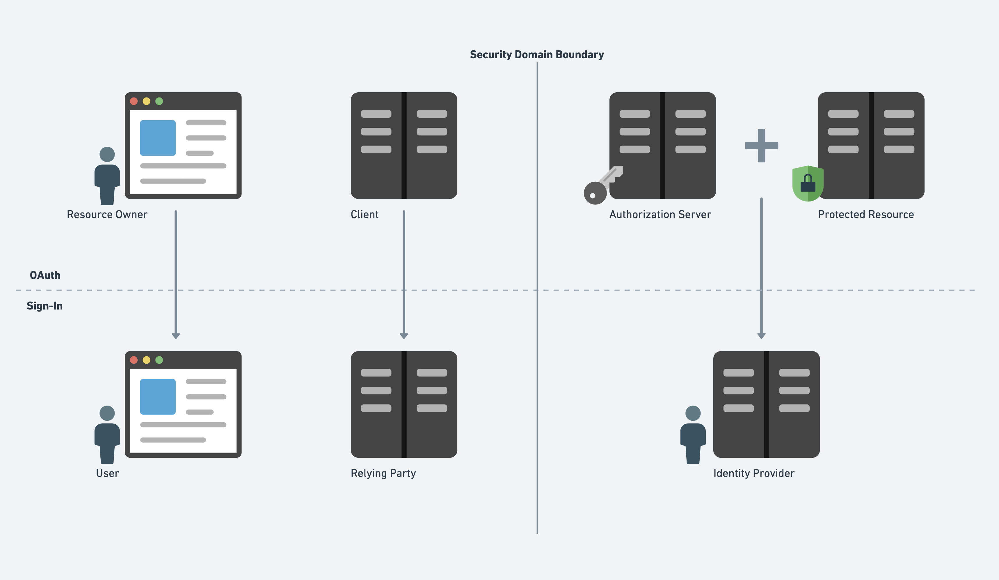
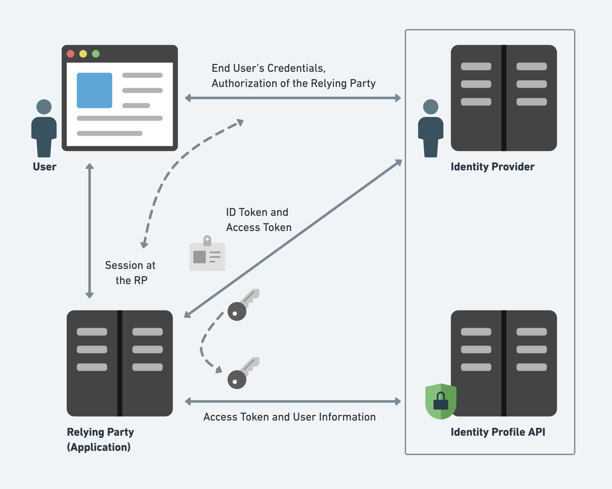

[WG - Web Authorization Protocol (oauth)](https://datatracker.ietf.org/group/oauth/documents/)

OAuth 2.0 is not an authentication protocol. But we can build the authentication protocol based on OAuth 2.0.

# Authorization code grant flow

```

 resource owner                client            authorization server     protected resource
        │                        │                        │                       │
        │    client redirects    │                        │                       │
        │      user agent to     │                        │                       │
        │ authorization endpoint │                        │                       │
        │◄───────────────────────┤                        │                       │
        │                        │                        │                       │
        │    user agent loads    │                        │                       │
        │ authorization endpoint │                        │                       │
        ├────────────────────────┼───────────────────────►│                       │
        │                        │                        │                       │
        │     resource owner     │                        │                       │
        │    authenticates to    │                        │                       │
        │  authorization server  │                        │                       │
        │◄───────────────────────┼───────────────────────►│                       │
        │                        │                        │                       │
        │     resource owner     │                        │                       │
        │   authorizes client    │                        │                       │
        │◄───────────────────────┼───────────────────────►│                       │
        │                        │                        │                       │
        │                authorization server redirects   │                       │
        │                   user agent to client with     │                       │
        │                      authorization code         │                       │
        │◄───────────────────────┬────────────────────────┤                       │
        │                        │                        │                       │
        │   user agent loads     │                        │                       │
        │    redirect URI at     │                        │                       │
        │      client with       │                        │                       │
        │   authorization code   │                        │                       │
        ├───────────────────────►│                        │                       │
        │                        │                        │                       │
        │                        │      client sends      │                       │
        │                        │   authorization code   │                       │
        │                        │and it's own credentials│                       │
        │                        │    to token endpoint   │                       │
        │                        ├───────────────────────►│                       │
        │                        │                        │                       │
        │                        │  authorization server  │                       │
        │                        │   sends access token   │                       │
        │                        │       to client        │                       │
        │                        │◄───────────────────────┤                       │
        │                        │                        │                       │
        │                        │ client sends access token                      │
        │                        │  to protected resource │                       │
        │                        ├────────────────────────┼──────────────────────►│
        │                        │                        │                       │
        │                        │                        │  protected resource   │
        │                        │                        │  returns resource to  │
        │                        │                        │       client          │
        │                        │◄───────────────────────┼───────────────────────┤
        │                        │                        │                       │
      ──┴──                    ──┴──                    ──┴──                   ──┴──

```

# Using a refresh token

```

 client                         protected resource                    authorization server
   │                                     │                                      │
   │                                     │                                      │
   │ request resource with access token  │                                      │
   ├────────────────────────────────────►│                                      │
   │                                     │                                      │
   │                    error response   │                                      │
   │◄────────────────────────────────────┤                                      │
   │                                     │                                      │
   │ refresh access token                │                                      │
   ├─────────────────────────────────────┼─────────────────────────────────────►│
   │                                     │                                      │
   │                                     │          return new access token and │
   │                                     │            refresh token to client   │
   │◄────────────────────────────────────┼──────────────────────────────────────┤
   │                                     │                                      │
   │ request resource with access token  │                                      │
   ├────────────────────────────────────►│                                      │
   │                                     │                                      │
   │            response with resource   │                                      │
   ├─────────────────────────────────────┤                                      │
   │                                     │                                      │
 ──┴──                                 ──┴──                                  ──┴──

```

# Choosing the right grant type

```

 ┌──────────────────────┐      ┌─────────────────────────────┐      ┌────────────────────────┐
 │ Is the client acting │ Yes  │   Can the resource owner    │ Yes  │  Is the client running │ Yes
 │    on behalf of a    ├──────► interact with a web browser ├──────► completely inside of a ├────────► Implicit
 │   resource owner?    │      │   while using the client?   │      │      web browser?      │
 └───────────┬──────────┘      └──────────────┬──────────────┘      └────────────┬───────────┘
        No   │                           No   │                             No   │
             │                                │                                  │
             │                   ┌────────────▼──────────────┐                   │
             │                   │   Does the user have a    │                   ▼
             │                   │ simple set of credentials │           Authorization Code
             │                   │     like a password?      │                   │
             │                   └────────────┬──────────────┘                   │
             │                           Yes  │                                  │
             │                                │                                  │
             │                                │                                  │
             │                                ▼                       ┌──────────▼─────────────┐
             │                     Resource Owner Credentials         │ Is the client a native │ Yes    Add PKCE
             │                                                        │     application?       ├──────► or DynReg
             │                                                        └────────────────────────┘
             │
             │
 ┌───────────▼──────────┐
 │ Is the client acting │
 │ on its own behalf?   ├────────────► Client Credentials
 └───────────┬──────────┘
        No   │
             │
             │
 ┌───────────▼───────────┐
 │ Is the client acting  │
 │ on the authority of a ├───────────────► Assertion
 │ trusted third party?  │
 └───────────────────────┘

```

# Common vulnerabilities

## Common client vulnerabilities

Summary first:

- Use the state parameter as suggested in the specification (even if it isn't mandatory).
- Understand and carefully choose the correct grant (flow) your application needs to use.
- Native applications shouldn't use the implicit flow, as it's intended for in-browser clients.
- Native clients can't protect a client_secret unless it's configured at runtime as in the dynamic registration case.
- The registered redirect_uri must be as specific as it can be.
- Do NOT pass the access_token as a URI parameter if you can avoid it.

### CSRF attack against the client

CSRF explained on [OWASP](https://owasp.org/www-community/attacks/csrf).

```

 Attacker                        Victim                    Vulnerable Client          Authorization Server
    │                               │                              │                              │
    │                               │                              │                              │
    │     Attacker receives or      │                              │                              │
    │   forges authorization code   │                              │                              │
    │◄──────────────────────────────┼──────────────────────────────┼──────────────────────────────┤
    │                               │                              │                              │
    │                               │                              │                              │
    │  Attacker sends CSRF attack   │                              │                              │
    │    to victim, targeted at     │                              │                              │
    │   client's redirect URI and   │                              │                              │
    │     including attacker's      │                              │                              │
    │      authorization code       │                              │                              │
    ├──────────────────────────────►│                              │                              │
    │                               │                              │                              │
    │                               │                              │                              │
    │                               │    Victim's browser loads    │                              │
    │                               │  the redirect URI including  │                              │
    │                               │ the attacker's authorization │                              │
    │                               │            code              │                              │
    │                               ├─────────────────────────────►│                              │
    │                               │                              │                              │
    │                               │                              │                              │
    │                               │                              │   Client sends attacker's    │
    │                               │                              │ authorization code to server │
    │                               │                              ├─────────────────────────────►│
    │                               │                              │                              │
  ──┴──                           ──┴──                          ──┴──                          ──┴──

```

After the flow above, victim connects to the attacker's authorization context.

This kind of attack can be prevented by including an unguessable state in the URI.

### Theft of client credentials

What about native applications? Even the most arcane artifact can be decompiled and the `client_secret` is then no longer that secret. The same principle applies to mobile clients and desktop native applications. Failing to remember this simple principle might lead to disaster.

This kind of attack can be prevented by dynamic registration.

### Registration of the redirect URI

Your OAuth callback endpoint is

`https://yourouauthclient.com/oauth/oauthprovider/callback`

but you registered as

`https://yourouauthclient.com/`

An excerpt of the request originated by your OAuth client while performing the OAuth integration might look like

`https://oauthprovider.com/authorize?response_type=code&client_id=CLIENT_ID&scope=SCOPES&state=STATE&redirect_uri=https://yourouauthclient.com/oauth/oauthprovider/callback`

The attacker also needs to be able to create a page on the target site underneath the registered redirect URI, for example:

`https://yourouauthclient.com/usergeneratedcontent/attackerpage.html`

From here, it's enough for the attacker to craft a special URI of this form:

`https://oauthprovider.com/authorize?response_type=code&client_id=CLIENT_ID&scope=SCOPES&state=STATE&redirect_uri=https://yourouauthclient.com/usergeneratedcontent/attackerpage.html`

The victim will end up with

`https://yourouauthclient.com/usergeneratedcontent/attackerpage.html?code=e8e0dc1c-2258-6cca-72f3-7dbe0ca97a0b`

```

 Attacker                        Victim                    Vulnerable Client          Authorization Server
    │                               │                              │                              │
    │                               │                              │                              │
    │                               │                              │                              │
    │                               │    Victim authorizes a       │                              │
    │                               │     vulnerable client        │                              │ HTTP 302
    │                               ├──────────────────────────────┼─────────────────────────────►├──────┐
    │                               │                              │                              │      │
    │                               │                              │                              │      │
    │                               │                              │                              │      │
    │                               │◄─────────────────────────────┼──────────────────────────────┤◄─────┘
    │                               │                              │                              │
    │                               │                              │                              │
    │                               │                              │                              │
    │                               │  Victim's browser loads the  │                              │
    │                               │ redirect URI page, the HTML  │                              │
    │                               │  includes an img or script   │                              │
    │                               │  tag for a resource at the   │                              │
    │                               │      attacker's server       │                              │
    │                               ├─────────────────────────────►│                              │
    │   Victim's browser fetches    │                              │                              │
    │  the resource in the img or   │◄─────────────────────────────┤                              │
    │   script tag and sends the    │                              │                              │
    │   authorization code in the   │                              │                              │
    │        Referer header         │                              │                              │
    │◄─── ─── ─── ─── ─── ─── ─── ──┤                              │                              │
    │                               │                              │                              │
  ──┴──                           ──┴──                          ──┴──                          ──┴──

```

After the flow above, the attacker can get the victim's authorization code.

This kind of attack can be prevented by register the most specific redirect URI.

## Common protected resources vulnerabilities

Summary first:

- Sanitize all untrusted data in the protected resource response.
- Choose the appropriate Content-Type for the specific endpoint.
- Leverage browser protection and the security headers as much as you can.
- Use CORS if your protected resource's endpoint needs to support the implicit grant flow.
- Avoid having your protected resource support JSONP (if you can).
- Always use TLS in combination with HSTS.

## Common authorization server vulnerabilities

Summary first:

- Burn the authorization code once it’s been used.
- Exact matching is the ONLY safe validation method for redirect_uri that the authorization server should adopt.
- Implementing the OAuth core specification verbatim might lead us to have the authorization server acting as an open redirector. If this is a properly monitored redirector, this is fine, but it might pose some threats if implemented naively.
- Be mindful of information that can leak through fragments or Referer headers during error reporting.

### Hijacked authorization code (vulnerable authorization server)

Attackers can get the authorization code by leveraging the `Registration of the redirect URI`.

Now what an attacker can do is to present this hijacked authorization code to the OAuth callback of the victim’s OAuth client. At this point, the client will proceed and try to trade the authorization code for an access token, presenting valid client credentials to the authorization server. The authorization code is bound to the correct OAuth client.

```

 Attacker                 Victim                     Client             Authorization Server:   Authorization Server:      Protected Resource
    │                        │                         │                Authorization endpoint  Token endpoint                      │
    │                        │                         │                          │                      │                          │
    │                        │  Client redirects user  │                          │                      │                          │
    │                        │  agent to authorization │                          │                      │                          │
    │                        │        endpoint         │                          │                      │                          │
    │                        │◄─── ── ── ── ── ── ── ──┤                          │                      │                          │
    │                        │                         │                          │                      │                          │
    │                        │     User agent loads    │                          │                      │                          │
    │                        │  authorization endpoint │                          │                      │                          │
    │                        ├─────────────────────────┼─────────────────────────►│                      │                          │
    │                        │                         │                          │                      │                          │
    │                        │   Victim authenticates  │                          │                      │                          │
    │                        │ to authorization server │                          │                      │                          │
    │                        │◄────────────────────────┼─────────────────────────►│                      │                          │
    │                        │                         │                          │                      │                          │
    │                        │ Victim authorizes client│                          │                      │                          │
    │                        │◄────────────────────────┼─────────────────────────►│                      │                          │
    │                        │                         │                          │                      │                          │
    │                        │                         │   Authorization server   │                      │                          │
    │                        │                         │  redirects user agent to │                      │                          │
    │                        │                         │       attacker with      │                      │                          │
    │                        │                         │    authorization code    │                      │                          │
    │◄─── ── ── ── ── ── ── ─┤ ── ── ── ── ── ── ── ── ├── ── ── ── ── ── ── ── ──┤                      │                          │
    │                        │                         │                          │                      │                          │
    │     Attacker loads     │                         │                          │                      │                          │
    │ redirect URI at client │                         │                          │                      │                          │
    │      with victim's     │                         │                          │                      │                          │
    │   authorization code   │                         │                          │                      │                          │
    ├────────────────────────┼────────────────────────►│                          │                      │                          │
    │                        │                         │                          │                      │                          │
    │                        │                         │   Client sends hijacked  │                      │                          │
    │                        │                         │  authorization code and  │                      │                          │
    │                        │                         │   its own credential to  │                      │                          │
    │                        │                         │      token endpoint      │                      │                          │
    │                        │                         ├──────────────────────────┼─────────────────────►│                          │
    │                        │                         │                          │                      │                          │
    │                        │                         │                          │ Authorization server │                          │
    │                        │                         │                          │  sends access token  │                          │
    │                        │                         │                          │       to client      │                          │
    │                        │                         │◄─────────────────────────┼──────────────────────┤                          │
    │                        │                         │                          │                      │                          │
    │                        │                         │ Client sends access token│                      │                          │
    │                        │                         │   to protected resource  │                      │                          │
    │                        │                         ├──────────────────────────┼──────────────────────┼─────────────────────────►│
    │                        │                         │                          │                      │                          │
    │                        │                         │                          │                      │    Protected resource    │
    │                        │                         │                          │                      │ returns victim's resource│
    │                        │                         │                          │                      │   to attacker's client   │
    │◄─── ── ── ── ── ── ── ─┤ ── ── ── ── ── ── ── ── │◄─────────────────────────┼──────────────────────┼──────────────────────────┤
    │                        │                         │                          │                      │                          │
    │                        │                         │                          │                      │                          │
  ──┴──                    ──┴──                     ──┴──                      ──┴──                  ──┴──                      ──┴──

```

This kind of attack can be prevented by ensuring that the `redirect_uri` presented in the initial authorization request will match the one presented in the token request.

```js
if (code.request.redirect_uri) {
  if (code.request.redirect_uri != req.body.redirect_uri) {
    res.status(400).json({ error: "invalid_grant" })
    return
  }
}
```

### Open redirect

```
https://victim.com/authorize?response_type=code&client_id=CLIENT_ID&scope=WRONG_SCOPE&redirect_uri=https://attacker.com
```

Because the provided scope is wrong, authorization server might redirect resource owner to the `https://attacker.com`.

This kind of attack can be prevented by

- responding with an HTTP 400 (Bad Request) status code rather than to redirect back to the registered `redirect_uri`
- performing a redirect to an intermediate URI under the control of the authorization server to clear `Referer` information in the browser that may contain security token information
- appending ‘#’ to the error redirect URI (this prevents the browser from reattaching the fragment from a previous URI to the new location URI)

## Common OAuth token vulnerabilities

Summary first:

- Transmission of access tokens must be protected using secure transport layer mechanisms such as TLS.
- The client should ask for the minimum information needed (be conservative with the scope set).
- The authorization server should store hashes of the access token instead of clear text.
- The authorization server should keep access token lifetime short in order to minimize the risk associated with the leak of a single access token.
- The resource server should keep access tokens in transient memory.
- PKCE may be used to increase the safety of authorization codes.

### Proof Key for Code Exchange (PKCE)

Some sophisticated attacks can lead to the authorization code being hijacked. The authorization code isn’t useful on its own, especially if the client has its own client secret with which it can authenticate itself. However, native applications have specific problems with client secrets.

```

 Resource Owner                 Client             Authorization Server:   Authorization Server:      Protected Resource
        │                         │                Authorization endpoint  Token endpoint                      │
        │                         │                          │                      │                          │
        │  Client sends resource  │                          │                      │                          │
        │  owner to authorization │                          │                      │                          │
        │ endpoint with generated │                          │                      │                          │
        │      code challenge     │                          │                      │                          │
        │◄─── ── ── ── ── ── ── ──┤                          │                      │                          │
        │                         │                          │                      │                          │
        │     User agent loads    │                          │                      │                          │
        │  authorization endpoint │                          │                      │                          │
        ├─────────────────────────┼─────────────────────────►│                      │                          │
        │                         │                          │                      │                          │
        │      Resource owner     │                          │                      │                          │
        │     authenticates to    │                          │                      │                          │
        │   authorization server  │                          │                      │                          │
        │◄────────────────────────┼─────────────────────────►│                      │                          │
        │                         │                          │                      │                          │
        │      Resource owner     │                          │                      │                          │
        │    authorizes client    │                          │                      │                          │
        │◄────────────────────────┼─────────────────────────►│                      │                          │
        │                         │                          │                      │                          │
        │                         │   Authorization server   │                      │                          │
        │                         │   redirects user agent   │                      │                          │
        │                         │      to client with      │                      │                          │
        │                         │    authorization code    │                      │                          │
        │◄─── ── ── ── ── ── ── ──┤ ── ── ── ── ── ── ── ── ─┤                      │                          │
        │                         │                          │                      │                          │
        │     User agent loads    │                          │                      │                          │
        │  redirect URI at client │                          │                      │                          │
        │ with authorization code │                          │                      │                          │
        ├────────────────────────►│                          │                      │                          │
        │                         │                          │                      │                          │
        │                         │  Client sends verifier,  │                      │                          │
        │                         │  authorization code, and │                      │                          │
        │                         │    its own credentials   │                      │                          │
        │                         │     to token endpoint    │                      │                          │
        │                         ├──────────────────────────┼─────────────────────►│                          │
        │                         │                          │                      │                          │
        │                         │        Authorization server derives the code    ├──────┐                   │
        │                         │        challenge from the│code verifier and     │      │                   │
        │                         │        make sure that it matches the code       │      │                   │
        │                         │        challenge originally submitted           │◄─────┘                   │
        │                         │                          │                      │                          │
        │                         │                          │                      │                          │
        │                         │               Authorization server sends        │                          │
        │                         │               access token to client            │                          │
        │                         │◄─────────────────────────┬──────────────────────┤                          │
        │                         │                          │                      │                          │
        │                         │    Client sends access   │                      │                          │
        │                         │    token to protected    │                      │                          │
        │                         │          resource        │                      │                          │
        │                         ├──────────────────────────┼──────────────────────┼─────────────────────────►│
        │                         │                          │                      │                          │
        │                         │                          │                      │                          │
        │                         │                          │                      │                          │
      ──┴──                     ──┴──                      ──┴──                  ──┴──                      ──┴──

```

# OAuth tokens

OAuth tokens are the central defining component of an OAuth system.

- OAuth tokens can be in any format, as long as it’s understood by the authorization server and protected resources.
- OAuth clients never have to understand the format of a token (and shouldn’t ever try to do so, anyway).
- JWT defines a way to store structured information in a token.
- JOSE provides methods to cryptographically protect the content of a token.
- Introspection allows a protected resource to query the state of a token at runtime.
- Revocation allows a client to signal the authorization server to discard unwanted tokens after they have been issued, completing the token lifecycle.

# Dynamic client registration

Dynamic client registration is a powerful extension to the OAuth protocol ecosystem.

- Clients can dynamically introduce themselves to authorization servers, but they still need a resource owner’s authorization to access protected resources.
- Client IDs and client secrets are best issued by the authorization server that will accept them.
- Client metadata describes many attributes about the client and it can be included in a signed software statement.
- The dynamic client registration management protocol provides a full set of lifecycle management operations for dynamically registered clients over a RESTful API.

# User authentication with OAuth 2.0

Many people erroneously believe that OAuth 2.0 is an authentication protocol, but now you know the truth of the matter.

- OAuth 2.0 is not an authentication protocol, but it can be used to build an authentication protocol.
- Many existing authentication protocols that have been built using OAuth 2.0 are in use on the web today, most of them tied to specific providers.
- Designers of authentication protocols make many common mistakes on top of OAuth 2.0. These mistakes can be avoided with careful design of the authentication protocol.
- With a few key additions, the OAuth 2.0 authorization server and protected resource can act as an identity provider, and the OAuth 2.0 client can act as a relying party.
- OpenID Connect provides a carefully designed open standard authentication protocol built on top of OAuth 2.0.

## OpenID Connect

https://openid.net/connect/

OpenID Connect 1.0 is a simple identity layer on top of the OAuth 2.0 protocol.





# Protocols and profiles using OAuth 2.0

OAuth is a great foundation for building new protocols.

- UMA allows resource servers and authorization servers to be introduced together in a way that can be highly dynamic and user-driven across security domains.
- UMA adds new parties to the OAuth dance, most notably the requesting party, allowing true user-to-user sharing and delegation.
- HEART applies several open standards based on OAuth to the healthcare domain, profiling them to increase security and interoperability.
- HEART defines both mechanical and semantic profiles, allowing the lessons learned to reach beyond the healthcare domain and find wide applicability.
- iGov is in the formative stages of development, but it will define a set of profiles for government identity systems that could have far-reaching consequences.

## User Managed Access (UMA)

v1 documentation: https://docs.kantarainitiative.org/uma/rec-uma-core-v1_0.html

Throughout the entire process, neither the resource owner’s credentials nor the requesting party’s credentials were revealed to the resource server or the client. Additionally, sensitive personal information about either party has not been disclosed between them. The requesting party need only prove whatever minimum amount is required to fulfill the policies set by the resource owner.

```

 Resource Owner                    Protected Resource                   Authorization Server                        Client                          Requesting Party
       │                                    │                                    │                                     │                                    │
       │                                    │                                    │                                     │                                    │
       │    Pointing the resource to the    │                                    │                                     │                                    │
       │        authorization server        │                                    │                                     │                                    │
       ├── ── ── ── ── ── ── ── ── ── ── ──►│                                    │                                     │                                    │
       │                                    │  Discovery and Client Registration │                                     │                                    │
       │                                    │◄──────────────────────────────────►│                                     │                                    │
       │                                    │                                    │                                     │                                    │
       │             Using OAuth, get the protection access token (PAT)          │                                     │                                    │
       │                        with scope uma_protection                        │                                     │                                    │
       │◄──────────────────────────────────►│◄──────────────────────────────────►│                                     │                                    │
       │                                    │                                    │                                     │                                    │
       │                                    │       Register a resource set      │                                     │                                    │
       │                                    │◄──────────────────────────────────►│                                     │                                    │
       │                                    │                                    │                                     │                                    │
       │  Resource owner selects resources  │                                    │                                     │                                    │
       │         and sets policies          │                                    │                                     │                                    │
       ├── ── ── ── ── ── ── ── ── ── ── ── ├── ── ── ── ── ── ── ── ── ── ── ──►│                                     │                                    │
       │                                    │                                    │                                     │                                    │
       │                                    │                                    │                                     │   Initiate access of the resource  │
       │                                    │                                    │                                     │◄── ── ── ── ── ── ── ── ── ── ── ──┤
       │                                    │                                    │                                     │                                    │
       │                                    │                                    │    Client attempts to access the    │                                    │
       │                                    │                                    │   resource without an access token  │                                    │
       │                                    │◄───────────────────────────────────┼─────────────────────────────────────┤                                    │
       │                                    │                                    │                                     │                                    │
       │                                    │     Request a permission ticket    │                                     │                                    │
       │                                    │◄──────────────────────────────────►│                                     │                                    │
       │                                    │                                    │                                     │                                    │
       │                                    │    Return error with ticket and    │                                     │                                    │
       │                                    │        as_uri in the header        │                                     │                                    │
       │                                    ├────────────────────────────────────┼────────────────────────────────────►│                                    │
       │                                    │                                    │                                     │                                    │
       │                                    │                                    │   Discovery & Client Registration   │                                    │
       │                                    │                                    │◄───────────────────────────────────►│                                    │
       │                                    │                                    │                                     │                                    │
       │                                    │                                    │  Attempt to trade ticket for token  │                                    │
       │                                    │                                    │◄────────────────────────────────────┤                                    │
       │                                    │                                    │                                     │                                    │
       │                                    │                                    │    Ticket needs more information    │                                    │
       │                                    │                                    ├────────────────────────────────────►│                                    │
       │                                    │                                    │                                     │  Send to the authorization server  │
       │                                    │                                    │                                     │          to present claims         │
       │                                    │                                    │                                     ├── ── ── ── ── ── ── ── ── ── ── ───┤
       │                                    │                                    │                                     │                                    │
       │                                    │                                    │                Present claims to the authorization server                │
       │                                    │                                    │                     (using OIDC or another process)                      │
       │                                    │                                    │◄── ── ── ── ── ── ── ── ── ── ── ── ├── ── ── ── ── ── ── ── ── ── ── ───┤
       │                                    │                                    │                                     │                                    │
       │                                    │                                    │                                     │               Continue             │
       │                                    │                                    │                                     │◄── ── ── ── ── ── ── ── ── ── ── ──┤
       │                                    │                                    │                                     │                                    │
       │                                    │                                    │  Attempt to trade ticket for token  │                                    │
       │                                    │                                    │◄────────────────────────────────────┤                                    │
       │                                    │                                    │                                     │                                    │
       │                                    │                                    │       Issue access token (RPT)      │                                    │
       │                                    │                                    ├────────────────────────────────────►│                                    │
       │                                    │                                    │                                     │                                    │
       │                                    │    Client attempts to access the resource with the access token (RPT)    │                                    │
       │                                    │◄───────────────────────────────────┬─────────────────────────────────────┤                                    │
       │                                    │                                    │                                     │                                    │
       │                                    │     Introspect the access token    │                                     │                                    │
       │                                    │◄──────────────────────────────────►│                                     │                                    │
       │                                    │                                    │                                     │                                    │
       │                                    │         Return the resource        │                                     │                                    │
       │                                    ├────────────────────────────────────┼────────────────────────────────────►│                                    │
       │                                    │                                    │                                     │                                    │
       │                                    │                                    │                                     │                                    │
     ──┴──                                ──┴──                                ──┴──                                 ──┴──                                ──┴──

```

[WG - User Managed Access v2](https://kantara.atlassian.net/wiki/spaces/uma/overview)

## Health Relationship Trust (HEART)

The HEART working group is building on top of **OAuth**, **OpenID Connect**, and **UMA**. By locking down optional features and codifying best practices, HEART seeks to promote both higher security and greater interoperability between independent implementations.

[WG - HEART](https://openid.net/wg/heart/)

[Fast Healthcare Interoperable Resources](http://hl7.org/fhir/) (FHIR) specifications. FHIR defines a RESTful API for sharing healthcare data, and HEART’s semantic profiles are designed to secure it in a predictable manner.

## International Government Assurance (iGov)

[WG - iGov](https://openid.net/wg/igov/)

# Beyond bearer tokens

In many cases, we want to be able to move beyond this and have the client be able to prove that it’s in possession of something secret that is not sent across the wire. This ensures that even if a request is captured in transit, an attacker can’t reuse the token contained within because the attacker won’t have access to the secret as well.

OAuth bearer tokens provide simple and robust functionality, but it’s valuable to move beyond them for some use cases.

- PoP tokens are associated with a key known to the client.
- The client signs an HTTP request with the PoP key and sends it to the protected resource.
- The protected resource verifies the signature along with the access token itself.
- TLS token binding can bridge the layers of the network stack to allow for higher assurance in the connection.

## Proof of Possession (PoP) tokens

1. Authorization server will generate a RSA key pair and send it to client alongside access token.
2. Authorization server only store the public key.
3. Client signs the request to protected resource with private key.
4. Protected resource introspect the access token and get the public key for this AC.
5. Protected verify this request with the public key.
6. Return the resource or error.

The new one is [OAuth 2.0 Demonstrating Proof-of-Possession at the Application Layer (DPoP)](https://datatracker.ietf.org/doc/draft-ietf-oauth-dpop/)

## TLS token binding

https://en.wikipedia.org/wiki/Token_Binding
