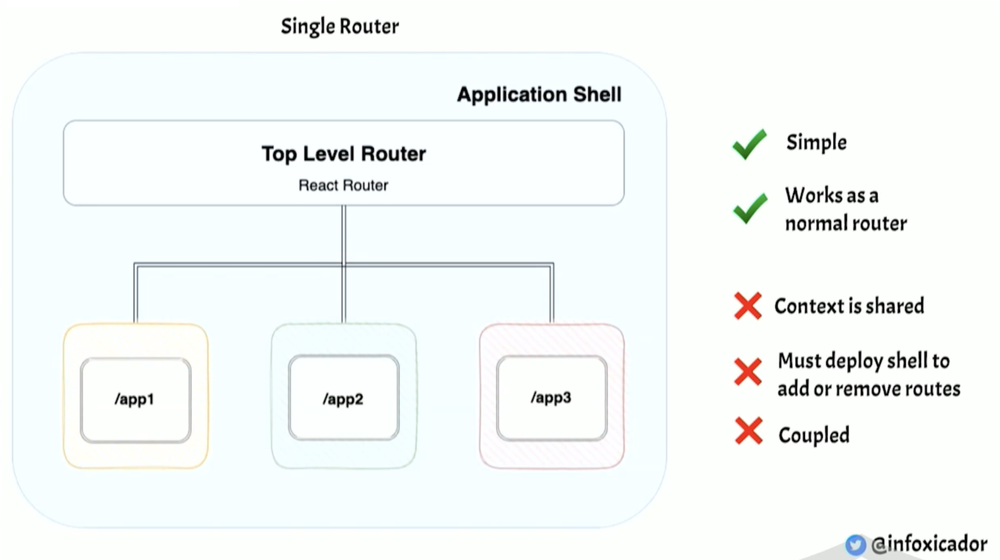
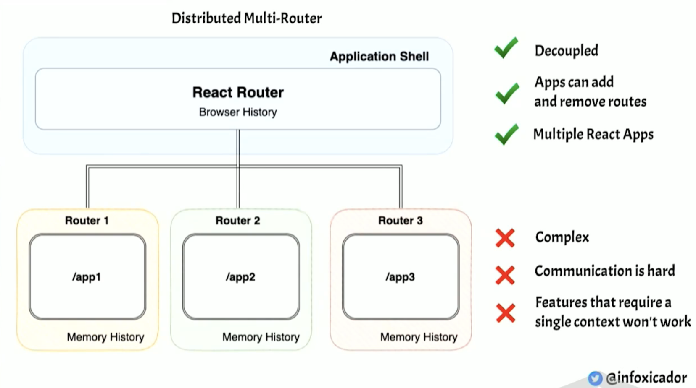
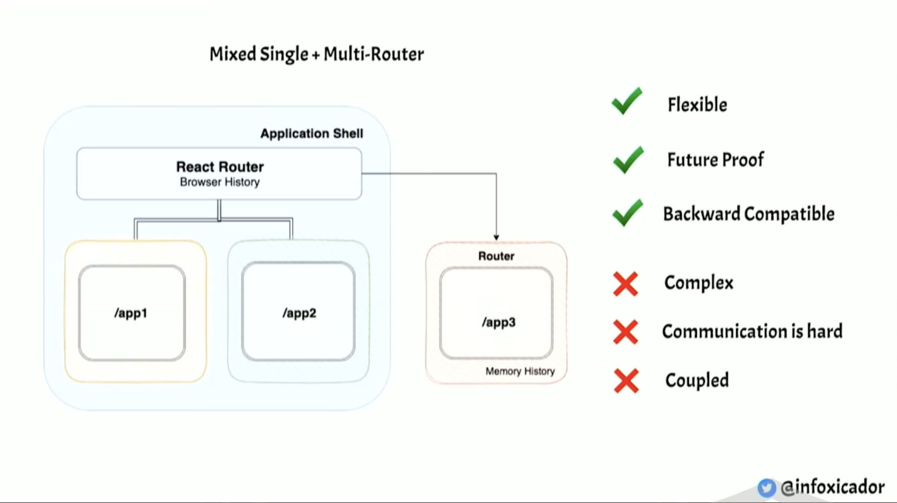
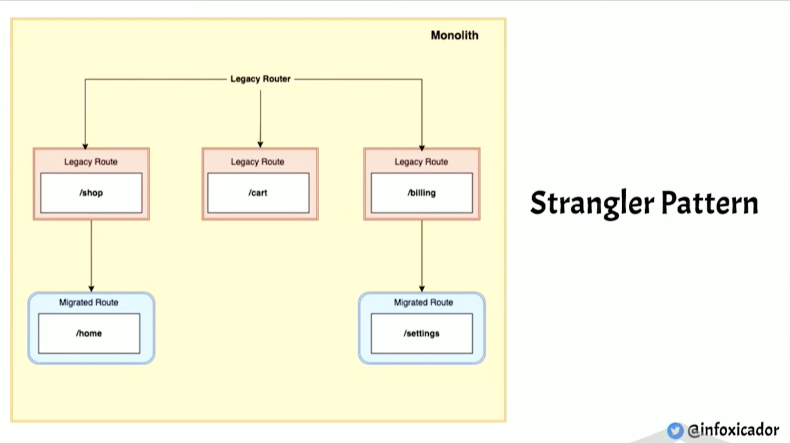
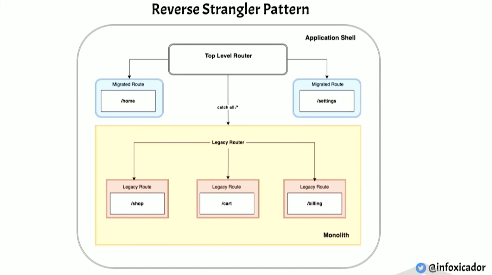
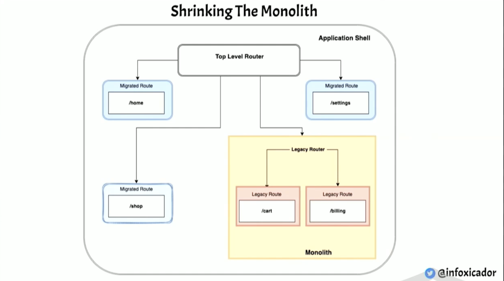

Micro Frontend Architecture is trying to solve an organizational issue, scaling, people, teams, etc.
It's not just technical. You can not just go to your decision makers and say "Ok, we're gonna use this
new architecture". In fact, most of problems are in the organization.

For a system to be distributed, it has to be decoupled first.

# Technical Plan

1.  Choosing a Composition Model
    - ex: client side composition with Webpack Module Federation
2.  Choosing a Router

    - Single Router (React Router)

      - ✅ simple
      - ✅ works as a normal router
      - ❌ context is shared
      - ❌ must deploy shell to add or remove routes
      - ❌ coupled

      

    - Distributed Muiti-Router

      - ✅ decoupled
      - ✅ apps can add and remove routes
      - ✅ multiple react apps
      - ❌ complex
      - ❌ communication is hard
      - ❌ features that require a single context won't work

      

    - Mixed Single + Multi-Router

      - ✅ Flexible
      - ✅ Future Proof
      - ✅ Backward Compatible
      - ❌ Complex
      - ❌ Communication is hard
      - ❌ Coupled

      

3.  Migration Strategy

    - Strangler Pattern

      

    - Reverse Strangler Pattern

      

      Put the whole monolith into the new architecture then shrinking the monolith.

      

# Organizational Plan

1. Vision and Strategy

   - Why do we want to do this?

2. Sense of Urgency

3. Bring People on Board

4. Be Open to New Approaches

   - That's wht it's very important to have reversible decisions because things change all the time.

# Questions:

- How does each micro-frontend talks to each other?
  - Like dark mode. (can be done by css custom properties)
  - Like shared state.
- ## How does authentication and authorization be done?

# Reference:

- Monolith to Micro-Frontends - https://portal.gitnation.org/contents/monolith-to-micro-frontends
