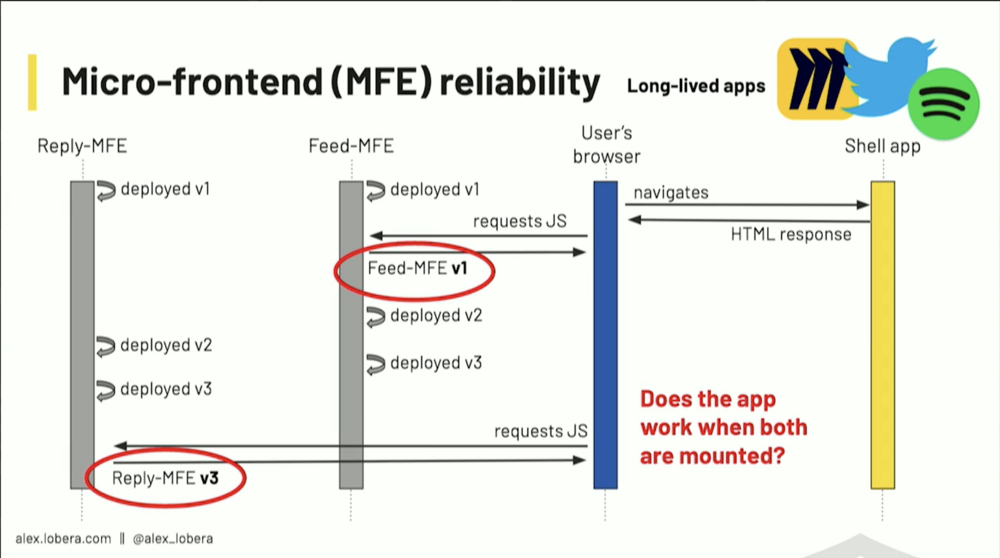
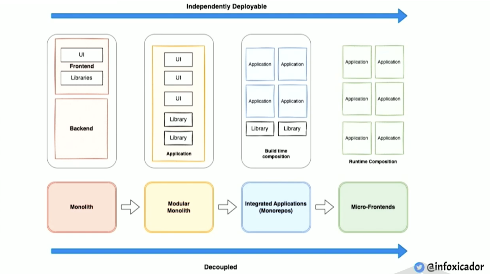

Micro Frontend Architecture is trying to solve an organizational issue, scaling, people, teams, etc.
It's not just technical. You can not just go to your decision makers and say "Ok, we're gonna use this
new architecture". In fact, most of problems are in the organization.

# Main benefit of micro-frontend

1. Business scalability
2. ?

# Micro-frontend cons

1. Performance can be affected:

   - App: duplicated code, work, requests, etc
   - Teams: duplicated work, e.g. CI/CD

2. Consistency

   - UI state, e.g. locale
   - Design, e.g. different versions of a design system

3. Reliability

   - Testing that two things deployed independently and composed at runtime work together is complex

   

## Trad-off

Performance + Consistency vs Reliability

# Design principles for building composable apps

1. Loosely coupled

   They should have strong boundaries, good interfaces, well-defined interfaces. The smaller Apps(micro-frontends) should have no dependence and dependencies should be ideally build time. That's gonna give you loose-coupled micro-frontends.

2. Executed independently

   Because if you're actually able to execute your micro-frontends independently without a lot of mocking and ceremony around it. It means it's actually loosely couple because otherwise you have to do a lot of work.

3. Autonomously developed

   You don't need to coordinate with other teams. You also need to reduce the coordinated load of executing all that big thing. You only execute a small subset in a smaller context. So you can develop autonomously.

4. Narrowed to a business domain

   Because we use our code to solve business problems. So you need to think business domain.

# How to plan the migration?

Monolith
-> packages
-> build independently
-> execute independently
-> runtime composition (or build time composition?)

For a system to be distributed, it has to be decoupled first.

## Technical Plan

1.  Choosing a Composition Model
    - ex: client side composition with Webpack Module Federation
2.  Choosing a Router

    - Single Router (React Router)

      - ✅ simple
      - ✅ works as a normal router
      - ❌ context is shared
      - ❌ must deploy shell to add or remove routes
      - ❌ coupled

      

    - Distributed Muiti-Router

      - ✅ decoupled
      - ✅ apps can add and remove routes
      - ✅ multiple react apps
      - ❌ complex
      - ❌ communication is hard
      - ❌ features that require a single context won't work

      

    - Mixed Single + Multi-Router

      - ✅ Flexible
      - ✅ Future Proof
      - ✅ Backward Compatible
      - ❌ Complex
      - ❌ Communication is hard
      - ❌ Coupled

      

3.  Migration Strategy

    - Strangler Pattern

      

    - Reverse Strangler Pattern

      

      Put the whole monolith into the new architecture then shrinking the monolith.

      

## Organizational Plan

1. Vision and Strategy

   - Why do we want to do this?

2. Sense of Urgency

3. Bring People on Board

4. Be Open to New Approaches

   - That's wht it's very important to have reversible decisions because things change all the time.

# Questions:

- How does each micro-frontend talks to each other?
  - Like dark mode. (can be done by css custom properties)
  - Like shared state.
- ## How does authentication and authorization be done?

# Reference:

- Monolith to Micro-Frontends - https://portal.gitnation.org/contents/monolith-to-micro-frontends
- Adopting Micro-Frontends Without Micro-Frontends - https://portal.gitnation.org/contents/adopting-micro-frontends-without-micro-frontends
- LeanJS - https://leanjs.com/
