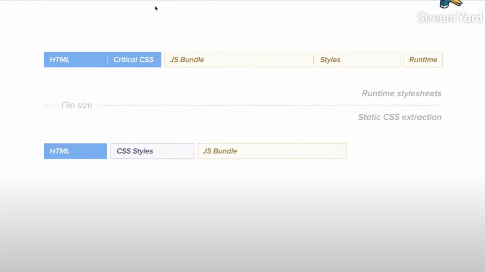
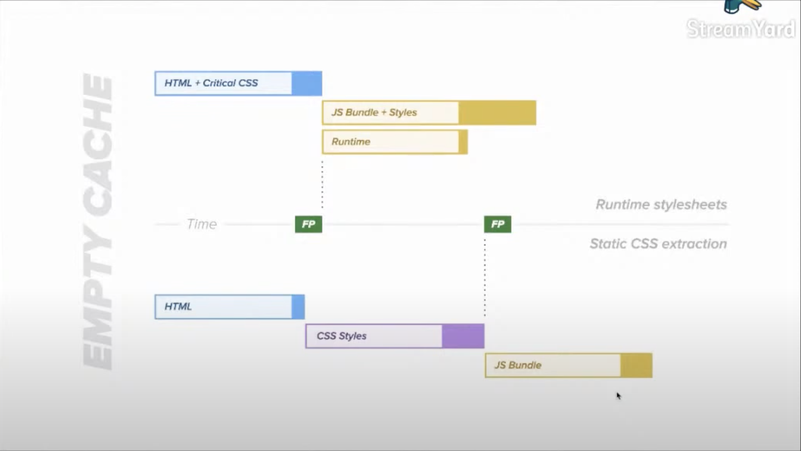
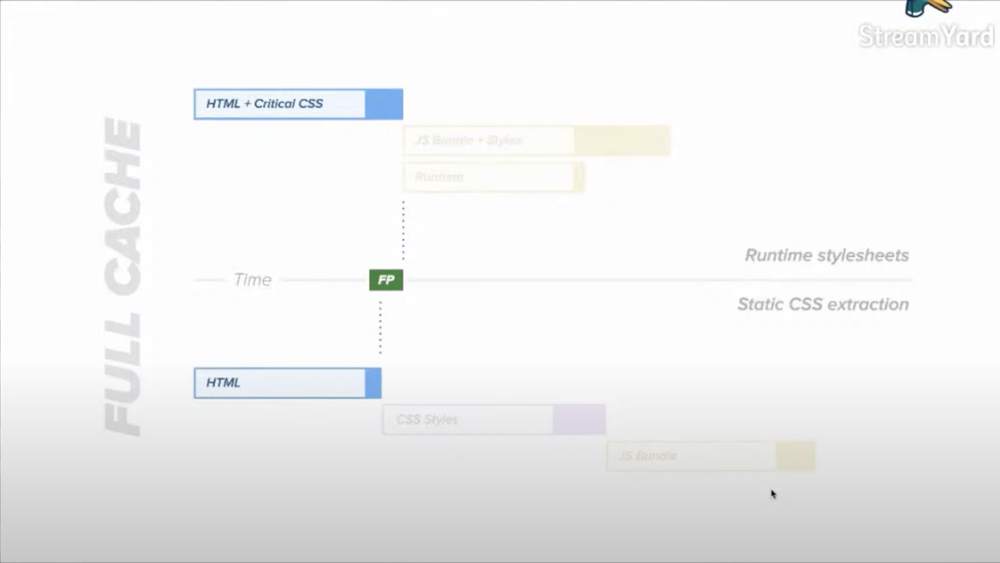

The trend of styling the frontend application is:

    CSS -> SASS -> CSS-in-JS -> Zero runtime CSS-in-JS

# Why CSS-in-JS?

CSS is not type-safe.

type-safe means:

- Type-checking
- Goto-definition
- Safe refactoring
- Used code detection
- Typed design tokens

# Styles Output: Runtime stylesheets vs Static CSS extraction

## When to use them

Use runtime stylesheets if you want to get faster First Paint metrics. Like CSR / SPA.

Use static CSS extraction if you want less bytes to be transferred and better caching. Like SSR.

# Linaria

Linaria is a zero-runtime CSS-in-JS library and looks very promising. But it's really poor documented (2023/02/12).

# Reference

- [A thorough analysis of CSS-in-TS (repo)](https://github.com/andreipfeiffer/css-in-js)
- [A Thorough Analysis of CSS-in-JS (post)](https://css-tricks.com/a-thorough-analysis-of-css-in-js/)
- [Airbnb’s Trip to Linaria](https://medium.com/airbnb-engineering/airbnbs-trip-to-linaria-dc169230bd12)
