# Compilers

## Introduction

There are two approaches to implementing programming languages, compilers, and interpreters.

```

           off-line                   Data
                                       │
               ┌────────────┐          │
               │            │          ▼
Program ──────►│  Compiler  ├─────► Executable
               │            │          │
               └────────────┘          │
                                       ▼
                                      Output

```

```

            on-line

               ┌─────────────┐
Program ──────►│             │
               │ Interpreter ├────► Output
   Data ──────►│             │
               └─────────────┘

```

The structure of a compiler:

- Lexical Analysis
- Parsing
- Semantic Analysis
- Optimization
- Code Generation

## Lexical Analysis

### Token Class (or Class)

- In English: noun, verb, adjective, ...
- In a programming language: Identifiers, Keywords, '(', ')', Numbers, ...

Token classes correspond to sets of strings

- Identifier: strings of letters or digits, starting with a letter (A1, Foo, B17)
- Integer: a non-empty string of digits (0, 12, 001, 00)
- Keyword: 'else' or 'if' or 'begin' or...
- Whitespace: a non-empty sequence of blanks, newlines, and tabs

### The Goal of a Lexical Analysis

Lexical Analyzer communicate tokens to the parser

```

                     ┌────────────────────┐      token       ┌──────────┐
  string             │                    │  <Class,string>  │          │
           ─────────►│  Lexical Analyzer  ├─────────────────►│  Parser  │
 foo = 42            │                    │                  │          │
                     └────────────────────┘                  └──────────┘

                                       <Id, "foo">  <Op, "=">  <Int, 42>

```

An implementation must do two things:

- Recognize substrings corresponding to tokens (The lexemes)
- Identify the token class of each lexeme

The goal is to partition the string. This is implemented by reading left-to-right, recognizing on token at a time. Lookahead may be required to decide where one token ends and the next token begins. But having lot of lookahead complicates the implementation of lexical analysis so one of the goals in the design of lexical systems is to minimize the amount of lookahead.

### Regular Languages

Regular languages is the usual tool to specify which set of string belongs to each token class.

- Single character

  'c' = {"c"}

- Epsilon

  ε = {""}

- Union

  A + B = {a | a ∈ A} ∪ {b | b ∈ B}

- Concatenation

  AB = {ab | a ∈ A, b ∈ B}

- Iteration

  A\* = Union(Ai) for i >= 0

Regular expressions(syntax) specify regular languages(set of strings).

### Formal Languages

#### Alphabet

**Def.** Let Σ be a set of characters (an alphabet). A language over Σ is a set of strings of characters drawn from Σ

Example:

1. English

   - Alphabet = English characters
   - Language = English sentences

2. C

   - Alphabet = ASCII
   - Language = C programs

#### Meaning Function

Meaning function `L` maps syntax to semantics

$$ L(e) = M $$

Use meaning function in the regular expression -> regular languages:

- L(ε) = {""}
- L('c') = {"c"}
- L(A + B) = L(A) ∪ L(B)
- L(AB) = {ab | a ∈ L(A), b ∈ L(B)}
- L(A\*) = Union(L(Ai)) for i >= 0

Why use a meaning function?

- Makes clear what is syntax, what is semantics
- Allows us to consider notation as a separate issue
- Because expressions and meanings are not 1-1
- Meaning is many to one (Never one to many)

### Lexical Specifications

#### Integer

Integer: a non-empty string of digits

```
digit = '0' + '1' + '2' + '3' + '4' + '5' + '6' + '7' + '8' + '9'
Integer = digit digit*
        = digit+
```

#### Identifier

Identifier: strings of letters or digits, starting with a letter

```
letter = 'a' + 'b' + 'c' + ... + 'z' + 'A' + 'B' + 'C' + ... + 'Z'
       = [a-zA-Z]
Identifier = letter(letter + digit)*
```

#### Whitespace

Whitespace: a non-empty sequence of blanks, newlines, and tabs

```
Whitespace = (' ' + '\n' + '\t' + ...)+
```

#### How to do?

1. Write a rexp for the lexemes of each token class

   - Number = digit+
   - Keyword = 'if' + 'else' + ...
   - Identifier = letter(letter + digit)\*
   - OpenPar = '('
   - ...

2. Construct R, matching all lexemes for all tokens

   ```
   R = Keyword + Identifier + Number + ...
     = R1 + R2 + ...
   ```

3. Let input be x1...xn

   For 1 <= 1 <= n check x1...xi ∈ L(R) ?

4. If success, then we know that

   x1...xi ∈ L(Rj) for some j

5. Remove x1...xi from input and go to (3)

#### Question1: But how much input is used? (To resolve ambiguities)

x1...xi ∈ L(R)
x1...xj ∈ L(R)
i != j

We should always tack the longer one, and that's called the Maximal Munch. The reason for this is that's just the way how humans themselves read things.

#### Question2: Which token is used? (To resolve ambiguities)

x1...xi ∈ L(R), R = R1 + ... + Rn

x1...xi ∈ L(Rj)
x1...xi ∈ L(Rk)

For example, "if" ∈ L(Keywords) and "if" ∈ L(Identifier)

The way this gets resolved is by a priority ordering and typically the rule is to choose the one listed first.

#### Question3: What if no rule matches? (To handle errors)

x1...xi ∉ L(R)

It's very important for compilers to do good error handling. They can't simply crash. The solution is to write a category of error strings and put it last in priority.

## Finite Automata

- Regular expressions = specification
- Finite automata = implementation

A finite automata consists of

- An input alphabet `Σ`
- A finite set of states `S`
- A start state `n`
- A set of accepting states `F ⊆ S`
- A set of transitions `state ->input state`

Language of a finite automata = set of accepted strings

Example: A finite automation that accepts only "1"


Example: A finite automaton that accepts any number of 1's followed by a single 0

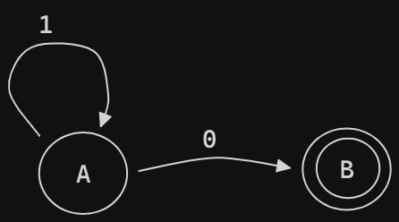

ε-moves is another kind of transition, it's a kind of free move from the machine. It can move to a different state without consuming any input.

### Two kinds of Finite Automata

- Deterministic Finite Automata (DFA)
  - One transition per input per state
  - No ε-moves
  - DFAs are faster to execute since there are no choices to consider
- Nondeterministic Finite Automata (NFA)
  - Can have multiple transitions for one input in a given state
  - Can have ε-moves
  - NFAs are, in general, smaller (exponentially smaller)

### Regular Expression to NFAs

Lexical Specification -> Regular expressions -> NFA -> DFA -> Table driven implementation of DFA

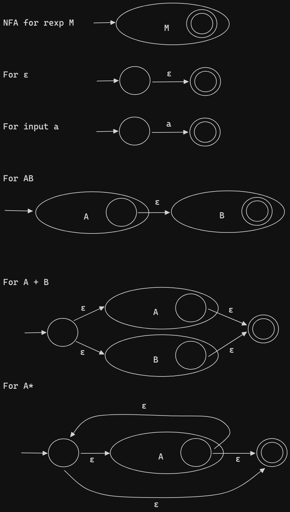

Example: `(1+0)*1`

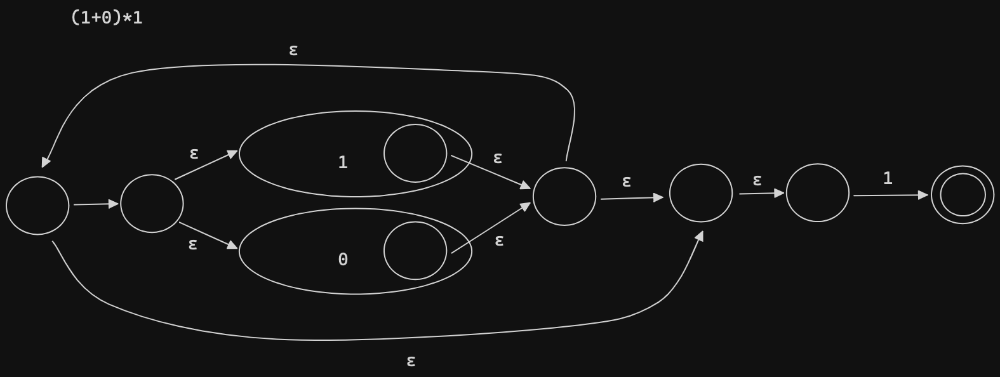

### NFA to DFA

`ε-closure(State A) = S` means State A could reach S (a set of states) by only epsilon moves.

|        | NFA          | DFA                          |
| ------ | ------------ | ---------------------------- |
| states | S (count: n) | subset of S (count: 2^n - 1) |
| start  | s ∈ S        | ε-closure(s)                 |
| final  | F ∈ S        | { X \| X ∩ F != ɸ}           |

states = subset of {ABCDEFGHIJ}, DFA has `2^10` states
start = {ABCDHI}
final = {EGABCDHIJ}

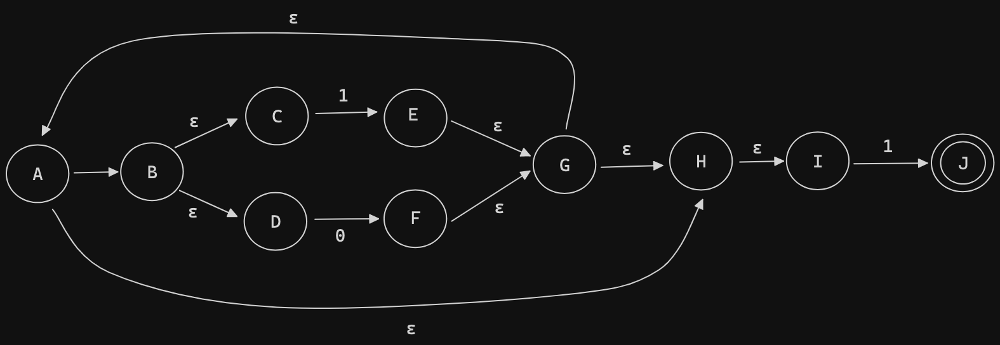
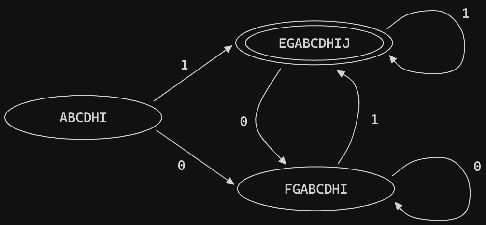

## Implementing Finite Automata

DFA table can get quite large since a DFA has 2^n states for a NFA with n states. Therefore, sometimes we would implement NFA directly instead of DFA.

DFA and NDA trade between speed and space.

- DFAs are faster but less compact
- NFAs are concise but slower

### DFA

A DFA can be implemented by a 2D table T

| state \ symbol | a       | b       |
| -------------- | ------- | ------- |
| i              | T[i, a] | T[i, b] |
| j              | T[j, a] | T[j, b] |
| k              | T[k, a] | T[k, b] |

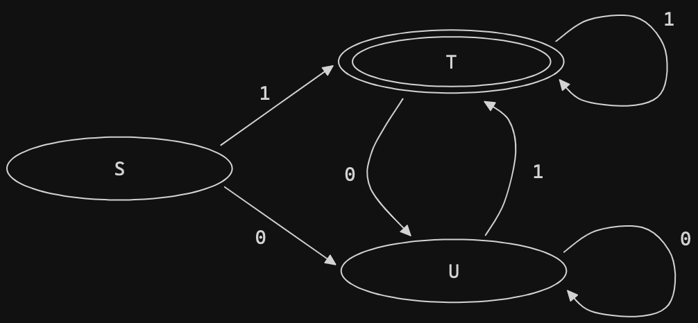

| state \ symbol | 0   | 1   |
| -------------- | --- | --- |
| S              | T   | U   |
| T              | T   | U   |
| U              | T   | U   |

```
i = 0
state = 0
while (input[i]) {
  state = TABLE[state, input[i]]
  i++
}
```

We can improve the table even further by making the DFA table into 1-dimensional table.

| state | pointer |
| ----- | ------- |
| S     | r1      |
| T     | r1      |
| U     | r1      |

`r1` is also a 1-dimensional table as following:

| 0   | 1   |
| --- | --- |
| T   | U   |

### NFA


| state \ symbol |  0  |  1  |   ε   |
| -------------- | :-: | :-: | :---: |
| A              |     |     | {B,H} |
| B              |     |     | {C,D} |
| C              |     | {E} |       |
| D              | {F} |     |       |
| E              |     |     |  {G}  |
| F              |     |     |  {G}  |
| G              |     |     | {A,H} |
| H              |     |     |  {I}  |
| I              |     | {J} |       |
| J              |     |     |       |

## Parsing

A parser takes the sequence of tokens from lexer as input and output the parse tree of the program.

### Context Free Grammars

Not all strings of tokens are programs, parser must distinguish between valid and invalid strings of tokens. So we need:

- a language for describing valid strings of tokens
- a method for distinguishing valid from invalid strings of tokens

Programming languages have a natural recursive structure. For example in Cool, An `EXPR` is

- if `EXPR` then `EXPR` else `EXPR` fi
- while `EXPR` loop `EXPR` pool
- ...

Context-free grammars are a natural notation for this recursive structure.

A CFG consists of

- A set of terminals `T`
- A set of non-terminals `N`
- A start symbol `S`
- A set of productions `X -> Y1...Yn`, where X ∈ N and Yi ∈ N ∪ T ∪ {ε}

#### The Process

1. Begin with a string with only the start symbol `S`
2. Replace any non-terminal `X` in the string by the right-hand side of some production X -> Y1...Yn
3. Repeat (2) until there are no non-terminals

#### Definition

Let `G` be a context-free grammar with start symbol `S`. Then the language `L(G)` of `G` is:

`{ a1...an | ∀i ai ∈ T and a1...an is reachable starting from S }`

### Derivation

- A derivation is a sequence of productions
- A derivation can be drawn as a tree
  - Start symbol is the tree's root
  - For a production `X -> Y1...Yn`, add children Y1...Yn to node X

Let's consider this example:

- Grammar

  ```
  E -> E + E
     | E * E
     | (E)
     | id
  ```

- String `id * id + id`

The left-most derivation is:

```
   E
-> E + E
-> E * E + E
-> id * E + E
-> id * id + E
-> id * id + id
```

And the parse tree build upon the left-most derivation is:

```
          E
       /  |  \
      E   +   E
   /  |  \    |
  E   *   E   id
  |       |
  id      id
```

- A parse tree has
  - Terminals at the leaves
  - Non-terminals at the interior nodes
- An in-order traversal of the leaves is the original input
- The parse tree shows the association of operations, the input string does node
- There is an equivalent notion of right-most derivation

  ```
    E
  -> E + E
  -> E + id
  -> E * E + id
  -> E * id + id
  -> id * id + id
  ```

Note that right-most and left-most derivations have the same parse tree.

- We are not just interested in whether s ∈ L(G)
  - We need a parse tree for s
- A derivation defines a parse tree
  - But one parse tree may have many derivations
- Left-most and right-most derivations are important in parser implementation

### Ambiguity

This string `id * id + id` has two parse trees

```
          E                      E
       /  |  \                /  |  \
      E   +   E              E   *   E
   /  |  \    |              |    /  |  \
  E   *   E   id             id  E   +   E
  |       |                      |       |
  id      id                     id      id
```

- A grammar is ambiguous if it has more than one parse tree for some string
  - Equivalently, there is more than one right-most or left-most derivation for some string
- Ambiguity is BAD
  - Leaves meaning of some programs ill-defined
- There are several ways to handle ambiguity
- Most direct method is to rewrite grammar unambiguously

  ```
  E -> E' + E | E'
  E' -> id * E' | id | (E) * E' | (E)
  ```

  so our `id * id + id` becomes:

  ```
          E
       /  |  \
      E'  +   E
   /  |  \    |
  id  *   E'  E'
          |   |
          id  id
  ```

- Enforces precedence of `*` over `+`

  E handles `+`: `E -> E' + E -> E' + E' + E -> ... -> E' + ... + E'`
  E' handles `*`:

  - `id * E' -> id * id * E' -> ... -> id * ... * id`
  - `(E) * E' -> (E) * (E) * E' -> ... -> (E) * ... * (E)`

The expression `if E1 then if E2 then E3 else E4` has two parse trees

```
      if             if
    / | \           /  \
   E1 if E4        E1   if
     /  \              / | \
    E2  E3           E2  E3 E4
```

We want to make the `else` matches the closest unmatched `then`

```
E -> MIF   /* all then are matched */
   | UIF   /* some then is unmatched */

MIF -> if E then MIF else MIF
     | OTHER

UIF -> if E then E
     | if E then MIF else UIF
```

## Top-Down Parsing

### Abstract Syntax Trees

A parser traces the derivation of a sequence of tokens, but the rest of the compiler needs a structural representation of the program. Parse Trees is such a data structure, but Abstract Syntax Trees is what we want to work on since it ignore some details.

### Recursive Descent Algorithm

Define boolean functions that check for a match of

- A given token terminal

  `bool term(TOKEN tok) { return *next++ = tok; }`

- The nth production of S

  `bool Sn() {...}`

- Try all productions of S

  `bool S() {...}`

Example:

```
E -> T | T + E
T -> int | int * T | (E)
```

- For production E -> T

  `bool E1() { return T(); }`

- For production E -> T + E

  `bool E2() { return T() && term(PLUS) && E(); }`

- For all productions of E (with backtracking)

  ```
  bool E() {
    TOKEN *save = next;
    return (next = save, E1())
        || (next = save, E2()); }
  ```

- Functions for non-terminal T

  ```
  bool T1() { return term(INT); }
  bool T2() { return term(INT) && term(TIMES) && T(); }
  bool T3() { return term(OPEN) && E() && term(CLOSE); }

  bool T() {
    TOKEN *save = next;
    return (next = save, T1())
        || (next = save, T2())
        || (next = save, T3()); }
  ```

#### Recursive Descent Algorithm Limitation

Use Recursive Descent Algorithm to parse `(int)` is good.

```
E -> T | T + E
T -> int | int * T | (E)
```

But Recursive Descent Algorithm can't parse `int * int`, it will be rejected since we do not apply backtracking once we have found a production that succeeds for non-terminals.

### Left Recursion (Left Factoring)

- In general, S -> Sα1 | ... | Sαn | β1 | ... | βm
- All strings derived from S starts with one of `β1,...,βm` and continue with serval instances of `α1,...,αn`
- Rewrite as
  - S -> β1S' | ... | βmS'
  - S' -> α1S' | ... | αnS' | ε

### Predictive Parsing Algorithm

Like recursive-descent but parser can predict which production to use by looking at the next few tokens and without backtracking. Predictive parsers accepts LL(k) grammars.

- First L: left-to-right
- Second L: left-most derivation
- k: k tokens lookahead

For this grammar, it's hard to predict

```
E -> T | T + E
T -> int | int * T | (E)
```

because:

- For `T` two productions start with `int`
- For `E` it is not clear how to predict

#### Fix the un-predictable grammar with left-factoring

```
E -> TX
X -> + E | ε
T -> intY | (E)
Y -> * T | ε
```

#### The LL(1) Parsing Table

| non-terminal \ terminal |  int  | \*  |  +  |  (  |  )  |  $  |
| ----------------------- | :---: | :-: | :-: | :-: | :-: | :-: |
| E                       |  TX   |     |     | TX  |     |     |
| X                       |       |     | + E |     |  ε  |  ε  |
| T                       | int Y |     |     | (E) |     |     |
| Y                       |       | \*T |  ε  |     |  ε  |  ε  |

```
initialize stack = <S$> and next
repeat
  case stack of
    <X, rest>  : if T[X, *next] = Y1...Yn
                    then stack  <- <Y1...Yn rest>;
                    else error();
    <t, rest>  : if t == *next ++
                    then stack <- <rest>;
                    else error();
until stack == < >
```

#### Parse the `int * int$`

| Stack  | Input       | Action   |
| ------ | ----------- | -------- |
| E$     | int \* int$ | TX       |
| TX$    | int \* int$ | intY     |
| intYX$ | int \* int$ | terminal |
| YX$    | \* int$     | \*T      |
| \*TX$  | \* int$     | terminal |
| TX$    | int$        | intY     |
| intYX$ | int$        | terminal |
| YX$    | $           | ε        |
| X$     | $           | ε        |
| $      | $           | ACCEPT   |

```
              E
             / \
            /   \
           T     X
          / \    |
         /   \   ε
       int    Y
             / \
            /   \
           *     T
                / \
               /   \
             int    Y
                    |
                    ε
```

#### First Sets

Definition: `First(X) = {t | X ->* tα} ∪ {ε | X ->* ε}`

Algorithm sketch:

1. First(t) = {t}, where t is a terminal
2. ε ∈ First(X)
   - if X -> ε
   - if X -> A1...An and ε ∈ First(Ai) for 1 <= A <= n
3. First(α) ⊆ First(X) if X -> A1...Anα
   - and ε ∈ First(Ai) for 1 <= A <= n

The first sets of this grammar:

```
E -> TX
X -> + E | ε
T -> intY | (E)
Y -> * T | ε
```

| X     | First(X)   |
| ----- | ---------- |
| `+`   | `{+}`      |
| `*`   | `{*}`      |
| `(`   | `{(}`      |
| `)`   | `{)}`      |
| `int` | `{int}`    |
| `E`   | First(T)   |
| `T`   | `{(, int}` |
| `X`   | `{+, ε}`   |
| `Y`   | `{*, ε}`   |

#### Follow Sets

Definition: `Follow(X) = {t | S ->* βXtδ}`

Algorithm sketch:

1. $ ∈ Follow(S)
2. First(β) - {ε} ⊆ Follow(X)
   - For each production A -> αXβ
3. Follow(A) ⊆ Follow(X)
   - For each production A -> αXβ where ε ∈ First(β)

The follow sets of this grammar:

```
E -> TX
X -> + E | ε
T -> intY | (E)
Y -> * T | ε
```

| X     | Follow(X)      |
| ----- | -------------- |
| `+`   | `{(, int}`     |
| `*`   | `{(, int}`     |
| `(`   | `{(, int}`     |
| `)`   | `{$, +, )}`    |
| `int` | `{*, $, +, )}` |
| `E`   | `{$, )}`       |
| `T`   | `{$, +, )}`    |
| `X`   | `{$, )}`       |
| `Y`   | `{$, +, )}`    |

#### Construct LL(1) Parsing Table

For each production A -> α in the Grammar G do:

- For each terminal t ∈ First(α) do
  - T[A, t] = α
- If ε ∈ First(α), for each t ∈ Follow(A) do
  - T[A, t] = α
- If ε ∈ First(α) and $ ∈ Follow(A) do
  - T[A, $] = α

#### Most Programming Language CFGs Are Not LL(1)

If any entry is multiply defined then G is not LL(1)

For example: S -> Sa | b

First(S) = {b}
Follow(S) = {$, a}

|     | a   | b               | $   |
| --- | --- | --------------- | --- |
| S   |     | `b` and `Sa` ❌ |     |

A grammar isn't LL(1) if it is

- not left factored
- not left recursive
- ambiguous
- other grammar are not LL(1), ex: need more than 1 lookahead

## Bottom-up Parsing

- Bottom-up parsing is more general than (deterministic) top-down parsing.
  - And just as efficient as top-down parsing
  - And it's built on ideas in top-down parsing
- Bottom-up is the preferred method
- Bottom-up parsers don't need left-factored grammars
- Revert to the "natural" grammar for our example:

  ```
  E -> T + E | T
  T -> int * T | int | (E)
  ```

- Consider the string `int * int + int`

Bottom-up parsing reduces a string to the start symbol by inverting productions.

| input string      | inverted production |
| ----------------- | ------------------- |
| `int * int + int` | `T -> int`          |
| `int * T + int`   | `T -> int * T`      |
| `T + int`         | `T -> int`          |
| `T + T`           | `E -> T`            |
| `T + E`           | `E -> T + E`        |
| `E`               |                     |

### Important Fact #1: A bottom-up parser traces a rightmost derivation in reverse

- Let `αβω` be a step of a bottom-up parse
- Assume the next production is by `X -> β`
- Then `ω` is a string of terminals

### Actions

Bottom-up parsing uses only two kinds of actions:

- Shift: Move `|` one place to the right

  `ABC|xyz => ABCx|yz`

- Reduce: Apply an inverse production at the right end of the left string

  `Cbxy|ijk => CbA|ijk`, if `A -> xy` is a production

| left string    | input string         | action                |
| -------------- | -------------------- | --------------------- |
| `\|`           | `\|int * int + int`  | shift                 |
| `int \|`       | `int \| * int + int` | shift                 |
| `int * \|`     | `int * \| int + int` | shift                 |
| `int * int \|` | `int * int \| + int` | reduce `T -> int`     |
| `int * T \|`   | `int * T \| + int`   | reduce `T -> int * T` |
| `T \|`         | `T \| + int`         | shift                 |
| `T + \|`       | `T + \| int`         | shift                 |
| `T + int \|`   | `T + int \|`         | reduce `T -> int`     |
| `T + T \|`     | `T + T \|`           | reduce `E -> T`       |
| `T + E \|`     | `T + E \|`           | reduce `E -> T + E`   |
| `E \|`         | `E \|`               |                       |

### Handles

- In a given state, more than one action (shift or reduce) may lead to a valid parse
- If it is legal to shift or reduce, there is a shift-reduce conflict
- If it is legal to reduce by two different productions, there is a reduce-reduce conflict

Some reductions are fatal mistakes, for example:

```
E -> T + E | T
T -> int * T | int | (E)
```

Consider step `int | * int + int`

- We could reduce by `T -> int` giving `T | * int + int`
- But there is no way to reduce to the start symbol `E`

So, we want to reduce only if the result can still be reduced to the start symbol

- Assume a rightmost derivation

  `S ->* αXω -> αβω`

- Because `S` can go to `αX`, so its ok to reduce `X -> β`
- Then, `αβ` is handle of `αβω`

Definition: A handle is a reduction that also allows further reductions back to the start symbol.

### Important Fact #2: In shift-reduce parsing, handles appear only at the top of the stack, never inside

- Informal induction on # of reduce moves:
- True initially, stack is empty
- Immediately after reducing a handle
  – right-most non-terminal on top of the stack
  – next handle must be to right of right-most non-terminal, because this is a right-most derivation
  – Sequence of shift moves reaches next handle
- In shift-reduce parsing, handles always appear at the top of the stack
- Handles are never to the left of the right-most non-terminal
  – Therefore, shift-reduce moves are sufficient; the `|` need never move left
- Bottom-up parsing algorithms are based on recognizing handles

### Recognizing Handles

- Bad News
  - There are no known efficient algorithms to recognize handles
- Good News
  - There are good heuristics for guessing handles
  - On some CFGs, the heuristics always guess correctly

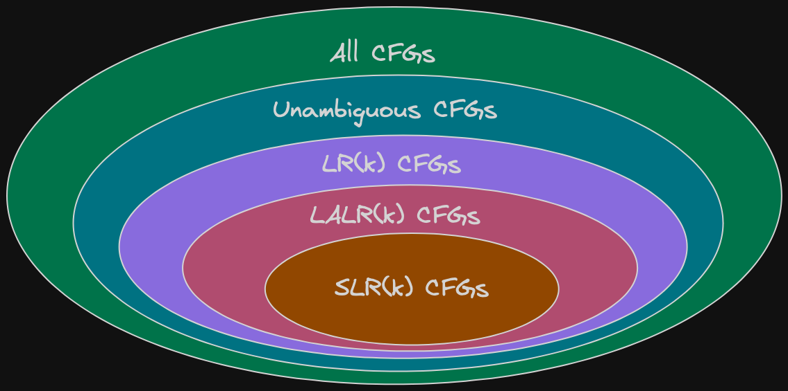

Definition: `α` is a viable prefix if there is an `ω` such that `α|ω` is a state of a shift-reduce parser

### Important Fact #3: For any grammar, the set of viable prefixes is a regular language

#### Introduce item to compute automata that accept viable prefixes

- An item is a production with a "." somewhere on the rhs
- The items for `T -> (E)` are
  - `T -> .(E)`
  - `T -> (.E)`
  - `T -> (E.)`
  - `T -> (E).`
- The only item for `X -> ε` is `X -> .`
- Items are often called "LR(0) items"

Consider the input `(int)`

```
E -> T + E | T
T -> int * T | int | (E)
```

- Then `(E|)` is a state of a shift-reduce parse
- `(E` is a prefix of the rhs of `T ->(E)`
  - will be reduced after the next shift
- Item `T -> (E.)` says that so far we have seen `(E` of this production and hope to see `(`

The structure of stack is not just arbitrary collections of symbols. In fact it has this very particular structure that holds the prefixes of right hand side.

- The stack have many prefixes of rhs's

  `Prefix(1)Prefix(2)...Prefix(n-1)Prefix(n)`

- Let `Prefix(i)` be a prefix of rhs of `Xi -> αi`
  - `Prefix(i)` will eventually reduce to `Xi`
  - The missing part of `αi-1` starts with `Xi`
  - i.e. there is a `Xi-1 -> Prefix(i-1)Xiβ` for `β`
- Recursively, `Prefix(k+1)...Prefix(n)` eventually reduces to the missing part of `αk`

#### Algorithm for Recognizing Viable Prefixes

1. Add a dummy production `S' -> S` to `G`
2. The NFA states are the items of `G`

   - including the extra production

3. For item `E -> α.Xβ` add transition

   `E -> α.Xβ ->X E -> αX.β`

4. For item `E -> α.Xβ` and production `X -> γ` add

   `E -> α.Xβ ->ε X -> .γ`

5. Every state is an accepting state
6. Start state is `S' -> S`

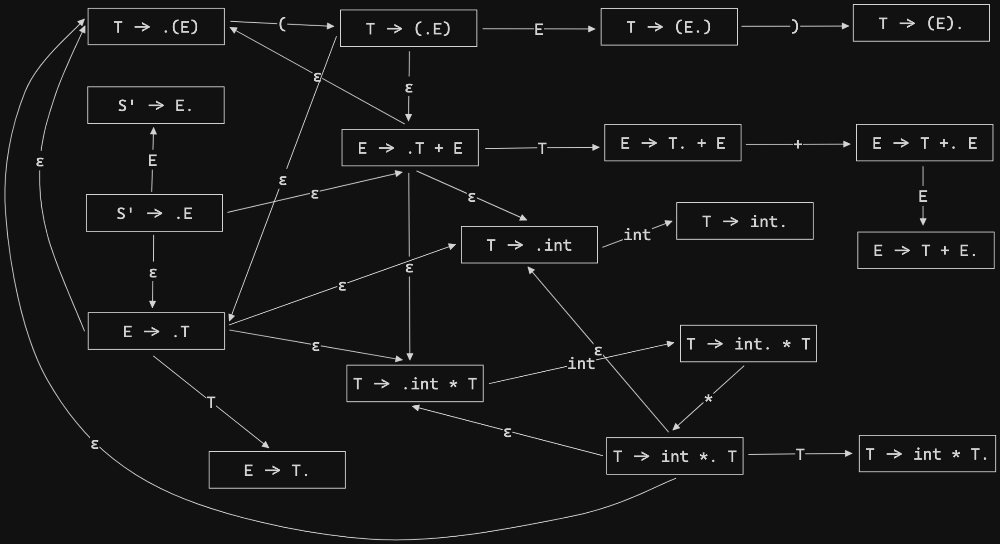

#### Valid Items

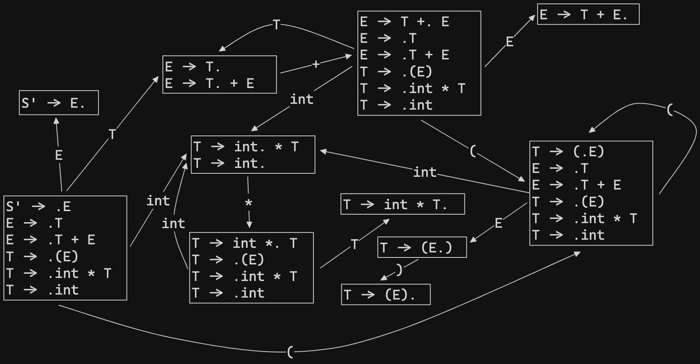

### SLR Parsing

LR(0) Parsing is a very week bottom up parsing algorithm.

- Assume
  - stack contains `α`
  - next input is `t`
  - DFA on input `α` terminates in state `s`
- Reduce by `X -> β` if
  - `s` contains item `X -> β.`
- Shift if
  - `s` contains item `X -> β.tω`
  - equivalent to saying `s` has a transition labeled `t`

Conflict:

- LR(0) has reduce/reduce conflict if:
  - Any state has two reduce items:
  - `X -> β.` and `Y -> ω.`
- LR(0) has a shift/reduce conflict if:
  - Any state has a reduce item and a shift item:
  - `X -> β.` and `Y -> ω.tδ`

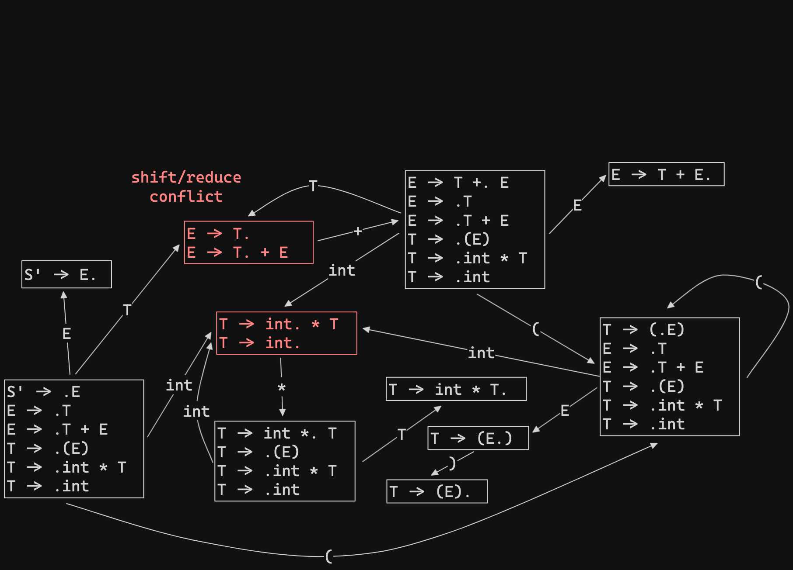

SLR = "Simple LR"

SLR improves on LR(0) shift/reduce heuristics so fewer states have conflicts.

- Assume
  - stack contains `α`
  - next input is `t`
  - DFA on input `α` terminates in state `s`
- Reduce by `X -> β` if
  - `s` contains item `X -> β.`
  - `t ∈ Follow(X)`
- Shift if
  - `s` contains item `X -> β.tω`

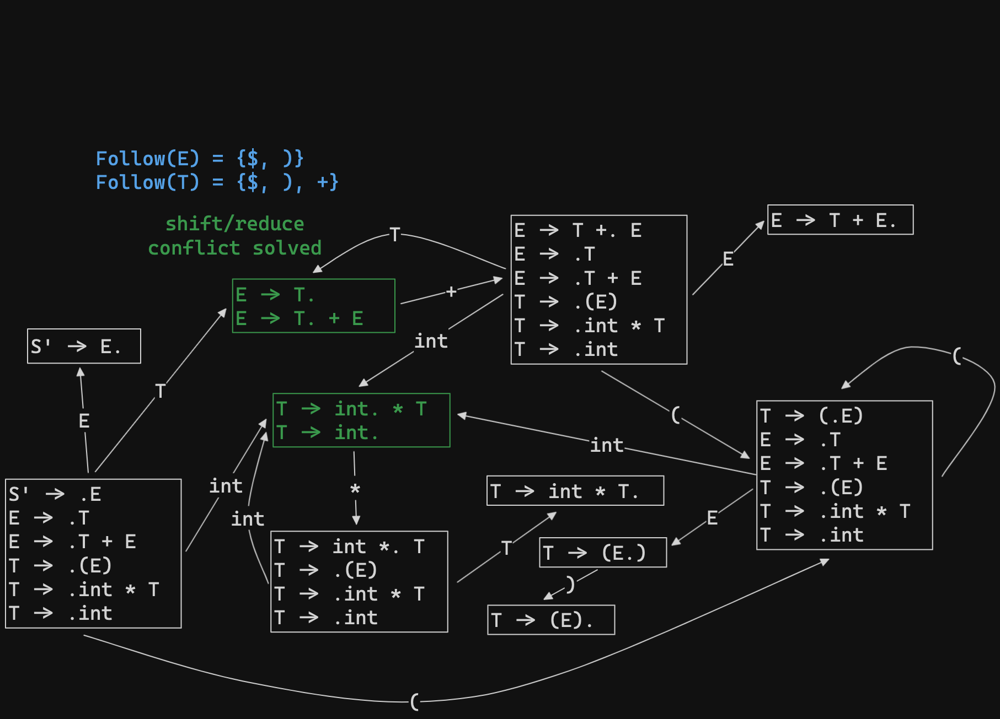

If there are conflicts under these rules, the grammar is not SLR

#### LSR Parsing Example

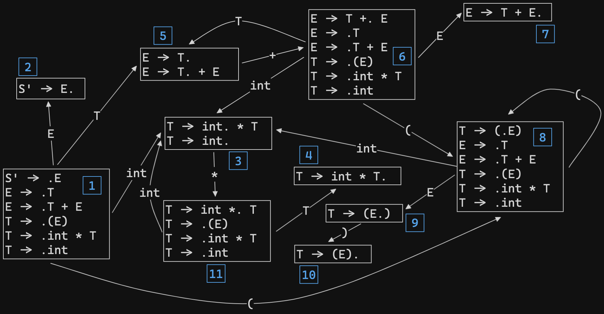

```
Follow(E) = {$, )}
Follow(T) = {$, +, )}
```

| Configuration   | DFA Halt State            | Action              |
| --------------- | ------------------------- | ------------------- |
| `\|int * int$`  | 1                         | shift               |
| `int \| * int$` | 3, `*` not in `Follow(T)` | shift               |
| `int * \| int$` | 11                        | shift               |
| `int * int\|$`  | 3, `$` ∈ `Follow(T)`      | red. `T -> int`     |
| `int * T\|$`    | 4, `$` ∈ `Follow(T)`      | red. `T -> int * T` |
| `T\|$`          | 5, `$` ∈ `Follow(E)`      | red. `E -> T`       |
| `E\|$`          |                           | accept              |

#### LSR improvement

- Rerunning the viable prefixes automation on the stack at each step is wasteful
  - Most of the work is repeated
- Remember the state of the automation on each prefix of the stack
- Change stack to contain pairs `<Symbol, DFA State>`

```
                        State 11 ->T State 4

│               │         │               │
├───────────────┤         ├───────────────┤
│  int  ,   3   │         │   T   ,       │       State 1 ->T State 5       State 1 ->E State 2
├───────────────┤         ├───────────────┤
│   *   ,  11   │   -->   │   *   ,  11   │   -->   │               │   -->   │               │
├───────────────┤         ├───────────────┤         ├───────────────┤         ├───────────────┤
│  int  ,   3   │         │  int  ,   3   │         │   T   ,       │         │   E   ,       │
├───────────────┤         ├───────────────┤         ├───────────────┤         ├───────────────┤
│       ,   1   │         │       ,   1   │         │       ,   1   │         │       ,   1   │
└───────────────┘         └───────────────┘         └───────────────┘         └───────────────┘

```

## Semantic Analysis

- Lexical analysis detects inputs with illegal tokens
- Parsing detects with ill-formed parse trees
- Semantic analysis catches all remaining errors, ex:
  - All identifiers are declared
  - Types
  - Inheritance relationships
  - Classes defined only once
  - Methods in a class defined only once
  - Reserved identifiers are not misused
  - ...

### Symbol Table

`let x: Int <- 0 in e`

- Before processing `e`, add definition of `x` to current definitions, overriding any other definition of `x`
- Recurse
- After processing `e`, remove definition of `x` and restore old definition of `x`

Symbol table:

- `enter_scope()`: start a new nested scope
- `find_symbol(x)`: finds current `x` (or null)
- `add_symbol(x)`: add a symbol `x` to the table
- `check_scope(x)`: true if `x` defined in the current scope
- `exit_scope()`: exit current scope

### Type Checking

If Hypothesis is true, then Conclusion is true

Building blocks:

- Symbol `∧` is "and"
- Symbol `=>` is "if-then"
- `x:T` is "`x` has type `T`"
- Symbol `⊢` is "it is provable that..."
- `T1 <= T2` is "`T1` is subtype of `T2`"
- `lub(X, Y)` is the "least upper bound" of `X` and `Y`
- Symbol `O` is "type environment", it's a mapping function `Object Identifiers -> Types`
- Symbol `M` is "method environment", `M(C, f) = (T1, ..., Tn, Tn+1)` means in class `C` there is a method `f(x1: T1, ..., xn: Tn): Tn+1`
- Symbol `C` is "current class"

If `e1` has type `Int` and `e2` has type `Int`, then `e1 + e2` has type `Int`

`(e1: Int ∧ e2: Int) => e1 + e2: Int`

```
i is an integer literal
-----------------------        [Int]
     O,M,C ⊢ i: Int
```

```
     O,M,C ⊢ e1: Int
     O,M,C ⊢ e2: Int
---------------------------    [Add]
    O,M,C ⊢ e1 + e2: Int
```

```

-----------------------        [False]
   O,M,C ⊢ false: Bool
```

```
 s is a string literal
-----------------------        [String]
   O,M,C ⊢ s: String
```

```
O[T/x](x) = T
O[T/x](y) = O(y), where y != x


     O[T0/x],M,C ⊢ e1: T1
------------------------------    [Let-No-Init]
  O,M,C ⊢ let x: T0 in e1: T1
```

```
     O,M,C ⊢ e0: T0
     O[T/x],M,C ⊢ e1: T1
     T0 <= T
----------------------------------    [Let-Init]
  O,M,C ⊢ let x: T <- e0 in e1: T1
```

```
         O,M,C ⊢ e0: T0
         O,M,C ⊢ e1: T1
              ...
         O,M,C ⊢ en: Tn
M(T0, f) = T(T1', ..., Tn', Tn+1')
    Ti <= Ti' for 1 <= i <= n
----------------------------------    [Dispatch]
  O,M,C ⊢ e0.f(e1, ..., en): Tn+1
```

#### Self Type

Self type can solve the type problem when dealing with inheritance. Consider a situation which `Stock` inherits `Count`:

```cool
class Count {
  i: int <- 0;
  inc(): Count {
    {
      i <- i + 1;
      self;
    }
  }
}

class Stock inherits Count {
  name: String;
}
```

Then the following:

```cool
class Main {
  Stock a <- (new Stock).inc();
  ...a.name...
}
```

- `(new Stock).inc()` has dynamic type `Stock`
- So it is legitimate to write `Stock a <- (new Stock).inc()`
- But this is not well-typed, `(new Stock).inc()` has static type `Count`
- The type checker "loses" type information
  - This makes inheriting `inc` useless
  - So, we must redefine `inc` for each of the subclasses, with a specialized return type

Modify the declaration of `inc` to read `inc(): SELF_TYPE {...}`

- The type checker can now prove:
  - `O,M,C ⊢ (new Count).inc(): Count`
  - `O,M,C ⊢ (new Stock).inc(): Stock`

Note that `SELF_TYPE` is not a dynamic type, it's a static type.

### Error Recovery

- What type is assigned to an expression with no legitimate type?
- This type will influence the typing of the enclosing expression

#### Assign type `Object` to ill-typed expressions

`let y: Int <- x + 2 in y + 3`

Errors:

- error: x is undefined
- error: + applied to Object
- error: bad assignment

It's a workable solution but with cascading errors

#### Introduce a new type `No_type` for use with ill-typed

- Defined `No_type <= C` for all types `C`
- Every operation is defined for `No_type`
  - With `No_type` result

`let y: Int <- x + 2 in y + 3`

Errors:

- error: x is undefined

A “real” compiler would use something like `No_type`, but the class hierarchy is not a tree anymore.

## Runtime Organization

The information needed to manage one procedure activation is called an activation record (AR) or frame.

```
 ┌────────────────────────┐
 │                        │
 │         result         │
 │                        │
 ├────────────────────────┤
 │                        │
 │        argument        │
 │                        │
 ├────────────────────────┤
 │                        │
 │      control link      │
 │                        │
 ├────────────────────────┤
 │                        │
 │     return address     │
 │                        │
 └────────────────────────┘
```

Memory layout looks like this:

```
 ┌────────────────────────┐  Higher Address
 │                        │
 │          Code          │
 │                        │
 ├────────────────────────┤
 │                        │
 │       Static Data      │
 │                        │
 ├────────────────────────┤
 │                        │
 │          Stack         │
 │                        │
 ├─ ── ── ── ── ── ── ── ─┤
 │                        │
 │           │            │
 │           ▼            │
 │                        │
 │                        │
 │           ▲            │
 │           │            │
 │                        │
 ├─ ── ── ── ── ── ── ── ─┤
 │                        │
 │          Heap          │
 │                        │
 └────────────────────────┘  Lower Address
```

## Code Generation

Here we focus on generating code for a stack machine with accumulator.

MIPS registers:

- `$a0` for accumulator
- `$sp` for stack pointer
- `$t1` for temporary register

MIPS instructions:

- `lw reg1 offset(reg2)`
  - load 32-bit word from address `reg2 + offset` into `reg1`
- `add reg1 reg2 reg3`
  - `reg1` <- `reg2` + `reg3`
- `sub reg1 reg2 reg3`
  - `reg1` <- `reg2` - `reg3`
- `sw reg1 offset(reg2)`
  - store 32-bit word in `reg1` at address `reg2 + offset`
- `addiu reg1 reg2 imm`
  - `reg1` <- `reg2` + `imm`
  - "u" means overflow is not checked
- `li reg imm`
  - `reg` <- `imm`
- `beq reg1 reg2 label`
  - branch to label if `reg1 == reg2`
- `b label`
  - unconditional jump to label

For each expression `e` we generate MIPS code that:

- Computes the value of `e` in $a0
- Preserves `$sp` and the contents of the stack

We define a code generation function `cgen(e)` whose result is the code generated for `e`

For constant:

```
cgen(i) = li $a0 i
```

For addition:

```
cgen(e1 + e2) =
    cgen(e1)
    sw $a0 0($sp)
    addiu $sp $sp -4
    cgen(e2)
    sw $t1 4($sp)
    add $a0 $t1 $a0
    addiu $sp $sp 4
```

For condition:

```
cgen(if e1 = e2 then e3 else e4) =
    cgen(e1)
    sw $a0 0($sp)
    addiu $sp $sp -4
    cgen(e2)
    sw $t1 4($sp)
    addiu $sp $sp 4
    beq $a0 t1
        false_branch:
            cgen(e4)
        b_end_if
        true_branch:
            cgen(e3)
        end_if
```

# Resource

- http://openclassroom.stanford.edu/MainFolder/DocumentPage.php?course=Compilers&doc=docs/pa.html
- https://web.stanford.edu/class/cs143/
- [StanfordOnline SOE.YCSCS1 on EDX](https://learning.edx.org/course/course-v1:StanfordOnline+SOE.YCSCS1+3T2020/home)
- [Engineering a Compiler 3rd Edition](https://www.amazon.com/-/zh_TW/Keith-D-Cooper/dp/0128154128/ref=sr_1_11)
