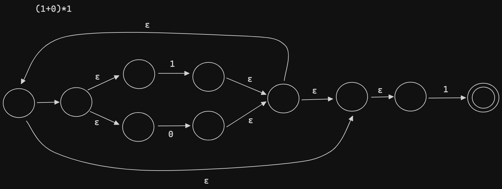

# Compilers

## Introduction

There are two approaches to implementing programming languages, compilers, and interpreters.

```

           off-line                   Data
                                       │
               ┌────────────┐          │
               │            │          ▼
Program ──────►│  Compiler  ├─────► Executable
               │            │          │
               └────────────┘          │
                                       ▼
                                      Output

```

```

            on-line

               ┌─────────────┐
Program ──────►│             │
               │ Interpreter ├────► Output
   Data ──────►│             │
               └─────────────┘

```

The structure of a compiler:

- Lexical Analysis
- Parsing
- Semantic Analysis
- Optimization
- Code Generation

## Lexical Analysis

### Token Class (or Class)

- In English: noun, verb, adjective, ...
- In a programming language: Identifiers, Keywords, '(', ')', Numbers, ...

Token classes correspond to sets of strings

- Identifier: strings of letters or digits, starting with a letter (A1, Foo, B17)
- Integer: a non-empty string of digits (0, 12, 001, 00)
- Keyword: 'else' or 'if' or 'begin' or...
- Whitespace: a non-empty sequence of blanks, newlines, and tabs

### The Goal of a Lexical Analysis

Lexical Analyzer communicate tokens to the parser

```

                     ┌────────────────────┐      token       ┌──────────┐
  string             │                    │  <Class,string>  │          │
           ─────────►│  Lexical Analyzer  ├─────────────────►│  Parser  │
 foo = 42            │                    │                  │          │
                     └────────────────────┘                  └──────────┘

                                       <Id, "foo">  <Op, "=">  <Int, 42>

```

An implementation must do two things:

- Recognize substrings corresponding to tokens (The lexemes)
- Identify the token class of each lexeme

The goal is to partition the string. This is implemented by reading left-to-right, recognizing on token at a time. Lookahead may be required to decide where one token ends and the next token begins. But having lot of lookahead complicates the implementation of lexical analysis so one of the goals in the design of lexical systems is to minimize the amount of lookahead.

### Regular Languages

Regular languages is the usual tool to specify which set of string belongs to each token class.

- Single character

  'c' = {"c"}

- Epsilon

  ε = {""}

- Union

  A + B = {a | a ∈ A} ∪ {b | b ∈ B}

- Concatenation

  AB = {ab | a ∈ A, b ∈ B}

- Iteration

  A\* = Union(Ai) for i >= 0

Regular expressions(syntax) specify regular languages(set of strings).

### Formal Languages

#### Alphabet

**Def.** Let Σ be a set of characters (an alphabet). A language over Σ is a set of strings of characters drawn from Σ

Example:

1. English

   - Alphabet = English characters
   - Language = English sentences

2. C

   - Alphabet = ASCII
   - Language = C programs

#### Meaning Function

Meaning function `L` maps syntax to semantics

$$ L(e) = M $$

Use meaning function in the regular expression -> regular languages:

- L(ε) = {""}
- L('c') = {"c"}
- L(A + B) = L(A) ∪ L(B)
- L(AB) = {ab | a ∈ L(A), b ∈ L(B)}
- L(A\*) = Union(L(Ai)) for i >= 0

Why use a meaning function?

- Makes clear what is syntax, what is semantics
- Allows us to consider notation as a separate issue
- Because expressions and meanings are not 1-1
- Meaning is many to one (Never one to many)

### Lexical Specifications

#### Integer

Integer: a non-empty string of digits

```
digit = '0' + '1' + '2' + '3' + '4' + '5' + '6' + '7' + '8' + '9'
Integer = digit digit*
        = digit+
```

#### Identifier

Identifier: strings of letters or digits, starting with a letter

```
letter = 'a' + 'b' + 'c' + ... + 'z' + 'A' + 'B' + 'C' + ... + 'Z'
       = [a-zA-Z]
Identifier = letter(letter + digit)*
```

#### Whitespace

Whitespace: a non-empty sequence of blanks, newlines, and tabs

```
Whitespace = (' ' + '\n' + '\t' + ...)+
```

#### How to do?

1. Write a rexp for the lexemes of each token class

   - Number = digit+
   - Keyword = 'if' + 'else' + ...
   - Identifier = letter(letter + digit)\*
   - OpenPar = '('
   - ...

2. Construct R, matching all lexemes for all tokens

   ```
   R = Keyword + Identifier + Number + ...
     = R1 + R2 + ...
   ```

3. Let input be x1...xn

   For 1 <= 1 <= n check x1...xi ∈ L(R) ?

4. If success, then we know that

   x1...xi ∈ L(Rj) for some j

5. Remove x1...xi from input and go to (3)

#### Question1: But how much input is used? (To resolve ambiguities)

x1...xi ∈ L(R)
x1...xj ∈ L(R)
i != j

We should always tack the longer one, and that's called the Maximal Munch. The reason for this is that's just the way how humans themselves read things.

#### Question2: Which token is used? (To resolve ambiguities)

x1...xi ∈ L(R), R = R1 + ... + Rn

x1...xi ∈ L(Rj)
x1...xi ∈ L(Rk)

For example, "if" ∈ L(Keywords) and "if" ∈ L(Identifier)

The way this gets resolved is by a priority ordering and typically the rule is to choose the one listed first.

#### Question3: What if no rule matches? (To handle errors)

x1...xi ∉ L(R)

It's very important for compilers to do good error handling. They can't simply crash. The solution is to write a category of error strings and put it last in priority.

## Finite Automata

- Regular expressions = specification
- Finite automata = implementation

A finite automata consists of

- An input alphabet `Σ`
- A finite set of states `S`
- A start state `n`
- A set of accepting states `F ⊆ S`
- A set of transitions `state ->input state`

Language of a finite automata = set of accepted strings

Example: A finite automation that accepts only "1"


Example: A finite automaton that accepts any number of 1's followed by a single 0


ε-moves is another kind of transition, it's a kind of free move from the machine. It can move to a different state without consuming any input.

### Two kinds of Finite Automata

- Deterministic Finite Automata (DFA)
  - One transition per input per state
  - No ε-moves
  - DFAs are faster to execute since there are no choices to consider
- Nondeterministic Finite Automata (NFA)
  - Can have multiple transitions for one input in a given state
  - Can have ε-moves
  - NFAs are, in general, smaller (exponentially smaller)

### Regular Expression to NFAs

Lexical Specification -> Regular expressions -> NFA -> DFA -> Table driven implementation of DFA


Example: `(1+0)*1`



### NFA to DFA

`ε-closure(State A) = S` means State A could reach S (a set of states) by only epsilon moves.

|        | NFA          | DFA                          |
| ------ | ------------ | ---------------------------- |
| states | S (count: n) | subset of S (count: 2^n - 1) |
| start  | s ∈ S        | ε-closure(s)                 |
| final  | F ∈ S        | { X \| X ∩ F != ɸ}           |

states = subset of {ABCDEFGHIJ}, DFA has `2^10` states
start = {ABCDHI}
final = {EGABCDHIJ}


## Implementing Finite Automata

DFA table can get quite large since a DFA has 2^n states for a NFA with n states. Therefore, sometimes we would implement NFA directly instead of DFA.

DFA and NDA trade between speed and space.

- DFAs are faster but less compact
- NFAs are concise but slower

### DFA

A DFA can be implemented by a 2D table T

| state \ symbol | a       | b       |
| -------------- | ------- | ------- |
| i              | T[i, a] | T[i, b] |
| j              | T[j, a] | T[j, b] |
| k              | T[k, a] | T[k, b] |


| state \ symbol | 0   | 1   |
| -------------- | --- | --- |
| S              | T   | U   |
| T              | T   | U   |
| U              | T   | U   |

```
i = 0
state = 0
while (input[i]) {
  state = TABLE[state, input[i]]
  i++
}
```

We can improve the table even further by making the DFA table into 1-dimensional table.

| state | pointer |
| ----- | ------- |
| S     | r1      |
| T     | r1      |
| U     | r1      |

`r1` is also a 1-dimensional table as following:

| 0   | 1   |
| --- | --- |
| T   | U   |

### NFA


| state \ symbol |  0  |  1  |   ε   |
| -------------- | :-: | :-: | :---: |
| A              |     |     | {B,H} |
| B              |     |     | {C,D} |
| C              |     | {E} |       |
| D              | {F} |     |       |
| E              |     |     |  {G}  |
| F              |     |     |  {G}  |
| G              |     |     | {A,H} |
| H              |     |     |  {I}  |
| I              |     | {J} |       |
| J              |     |     |       |

# Resource

- http://openclassroom.stanford.edu/MainFolder/DocumentPage.php?course=Compilers&doc=docs/pa.html
- https://web.stanford.edu/class/cs143/
- [StanfordOnline SOE.YCSCS1 on EDX](https://learning.edx.org/course/course-v1:StanfordOnline+SOE.YCSCS1+3T2020/home)
- [Engineering a Compiler 3rd Edition](https://www.amazon.com/-/zh_TW/Keith-D-Cooper/dp/0128154128/ref=sr_1_11)
