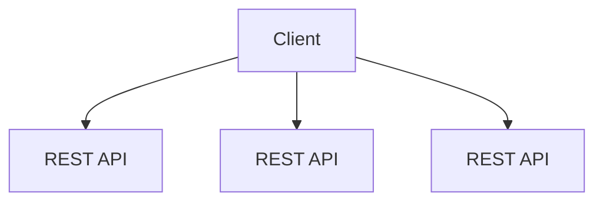
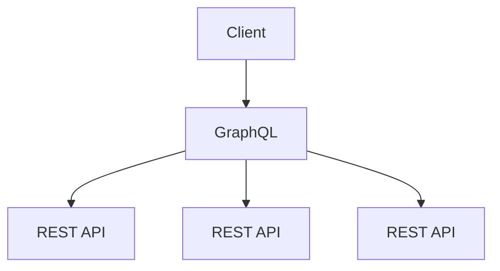
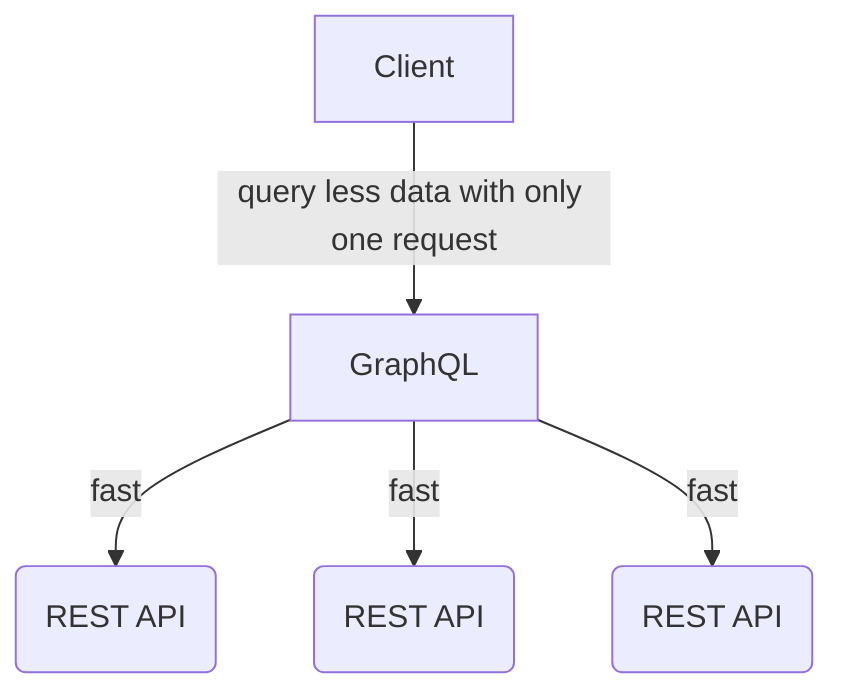
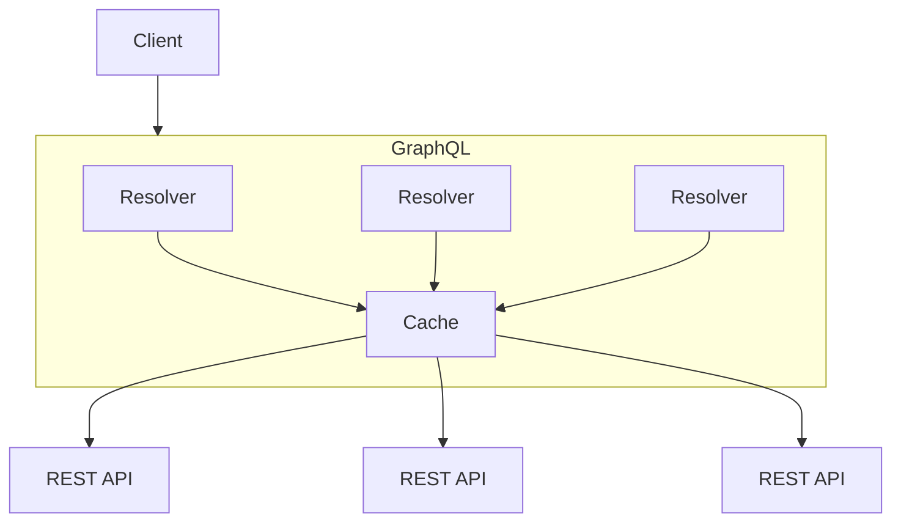

### Common problems of using a big monolithic GraphQL schema:

- Lack of focus on domain responsibilities caused by the presence of unrelated types and fields
- Merge conflicts caused by modifying the same schema file as multiple other individuals and teams
- Difficulty navigating to the information they need in a constantly growing schema file

### Why not approaching multiple graph with multiple endpoint?

- More data and services can be accessed from a single query
- Code, queries, skills, and experience are portable across teams
- One central catalog of all available data that all graph users can look to
- Implementation cost is minimized, because graph implementation work isn't duplicated
- Central management of the graph – for example, unified access control policies – becomes possible
- It's hard for frontend team to apply Data-masking Pattern

### Transform monolithic graph into a federated graph using Strangler Fig pattern:

1. The monolith is turned into a subgraph
2. The subgraph is published to Apollo Schema Registry using Rover CLI
3. Apollo attempts to compose supergraph
4. If composition succeeds, the supergraph schema then becomes available at Uplink.
   If it fails, it returns a composition error
5. Router polls latest supergraph schema at Uplink and is ready to handle queries across subgraphs
6. The monolith is then further split into multiple subgraphs
7. The subgraphs are published to Apollo Schema Registry using Rover CLI
8. Apollo attempts to compose supergraph
9. If composition succeeds, the supergraph schema then becomes available at Uplink.
   If it fails, it returns a composition error
10. Router polls latest supergraph schema at Uplink and is ready to handle queries across subgraphs

### Benefit of migrating with Strangler Fig pattern:

- We don't need to transfer over all of the subgraph types and fields at once. We can work in small chunks at a time.
- Splitting off subgraph's incrementally enables teams to reap the benefits sooner.
-

## In Netflix (Marketing Technology team)

- Our learnings from adopting GraphQL
- GraphQL Search Indexing
- How Netflix Scales its API with GraphQL Federation (Part 1)
- How Netflix Scales its API with GraphQL Federation (Part 2)
- Open Sourcing the Netflix Domain Graph Service Framework: GraphQL for Spring Boot
- Beyond REST
- How Netflix Content Engineering makes a federated graph searchable
- How Netflix Content Engineering makes a federated graph searchable (Part 2)

### From REST APIs to GraphQL API

- Simple pages would need to draw in data from a wide variety of sources.
- To more effectively load this data onto the client application, they first attempted to denormalize data on the backend.
- Managing this denormalization became difficult to maintain since not all pages needed all the data.
- They quickly ran into network bandwidth bottlenecks. The browser would need to fetch much more denormalized data then it would ever use.





### Benefits

#### Redistributing load and payload optimization



#### Reusable abstractions

Define entities in GraphQL exactly once and build the views for several pages form these definitions.

One page on the client app (catalogView) declares that it wants all comments for all creatives in a catalog.

```graphql
query catalogView($catalogId: String) {
  catalog(catalogId: $catalogId) {
    catalogName
    creatives {
      creativeName
      comments {
        userName
        message
      }
    }
  }
}
```

Another client page (creativeView) wants to know the associated catalog that a creative belongs to, along with all of its comments.

```graphql
query creativeView($creativeId: String) {
  creative(catalogId: $creativeId) {
    creativeName
    catalog {
      catalogName
    }
    comments {
      userName
      message
    }
  }
}
```

#### Chaining type systems

They use codegen tools to generate TypeScript types for the client application. Since these types and queries are also validated against the server schema, any breaking change by the server would be caught by clients consuming the data.

They gain type safety from the database layer all the way to the client browser.

```cassandra
CREATE TABLE Catalog (
  id uuid PRIMARY KEY,
  name varchar,
  treatment varchar
);
```

```java
public class Catalog {
  UUID id;
  String name;
  String treatment;
}
```

```ts
interface Catalog {
  id: string
  name: string
  treatment: string
}
```

#### DI/DX — Simplifying development

Developer don't need to consider how one piece of data relates to another, how data should be cached, whether to make the calls in parallel or in sequence. With a GraphQL wrapper, each component only needs to describe the data it needs, and the wrapper takes care of all of these concerns.

### Growing pains

#### Selfish resolvers

Since resolvers in GraphQL are meant to run as isolated units that are not concerned with what other resolvers do, many duplicate network requests for the same or similar data could be made.

This can be solved by adding a simple caching layer:



#### Debug

They add a logs directly to the GraphQL response payload that expose all of the network requests that the server is making. When the debug flag is enabled, you get the same data in the client browser as you would if the browser made the network call directly.

#### Breaking down typing

GraphQL can fetch the partial objects, so they can't be used in methods and components that require the full object.

This can be solved by using the data masking pattern in the client side.

#### Search Indexing

Entity relationship in GraphQL is useful for data aggregator, because no single service has complete context into how the system works. If we're using something like Elasticsearch to search across data, the GraphQL relationship can be useful in re-indexing our data to keep the search index up to date.
